# Geospatial visualizations {#geoviz}


```r
library(tidyverse)
library(sf)
library(ggmap)
library(rnaturalearth)
library(RColorBrewer)
library(patchwork)
library(tidycensus)
library(viridis)
library(here)

# useful on MacOS to speed up rendering of geom_sf() objects
if (!identical(getOption("bitmapType"), "cairo") && isTRUE(capabilities()[["cairo"]])) {
  options(bitmapType = "cairo")
}
```

## Learning objectives {-}

### Morning

* Introduce the major components of a geospatial visualization
* Identify how to draw raster maps using `ggmaps` and `get_map()`
* Practice generating raster maps

### Afternoon

* Define shapefiles and import spatial data using the `sf` package
* Draw maps using `ggplot2` and `geom_sf()`
* Change coordinate systems
* Generate appropriate color palettes to visualize additional dimensions of data

## Assigned readings {-}

* Chapter 7, @healy2018data - accessible via the [book's website](https://socviz.co/)

## Introduction to geospatial visualization

**Geospatial visualizations** are one of the earliest forms of information visualizations. They were used historically for navigation and were essential tools before the modern technological era of humanity. Data maps were first popularized in the seventeenth century and have grown in complexity and detail since then. Consider [Google Maps](https://www.google.com/maps), the sheer volume of data depicted, and the analytical pathways available to its users. Of course geospatial data visualizations do not require computational skills to generate.

### John Snow and the Broad Street water pump

<div class="figure" style="text-align: center">

<p class="caption">(\#fig:snow)Original map made by John Snow in 1854. Cholera cases are highlighted in black. [Source: Wikipedia.](https://commons.wikimedia.org/wiki/File:Snow-cholera-map-1.jpg)</p>
</div>

In the nineteenth century the theory of bacteria was not widely accepted by the medical community or the public.^[Drawn from [John Snow and the Broad Street Pump](http://www.ph.ucla.edu/epi/snow/snowcricketarticle.html)] A mother washed her baby's diaper in a well in 1854 in London, sparking an outbreak of **cholera**, an intestinal disease that causes vomiting, diarrhea, and eventually death. This disease had presented itself previously in London but its cause was still unknown.

Dr. John Snow lived in Soho, the suburb of London where the disease manifested in 1854, and wanted to understand how cholera spreads through a population (an early day epidemiologist). Snow recorded the location of individuals who contracted cholera, including their places of residence and employment. He used this information to draw a map of the region, recording the location of individuals who contracted the disease. They seemed to be clustered around the well pump along Broad Street. Snow used this map to deduce the source of the outbreak was the well, observing that almost all of the infected individuals lived near, and drank from, the well. Based on this information, the government removed the handle from the well pump so the public could not draw water from it. As a result, the cholera epidemic ended.

### *Carte figurative des pertes successives en hommes de l'Armée Française dans la campagne de Russie 1812-1813)*

<div class="figure" style="text-align: center">

<p class="caption">(\#fig:minard-orig)Charles Minard's 1869 chart showing the number of men in Napoleon’s 1812 Russian campaign army, their movements, as well as the temperature they encountered on the return path. [Source: Wikipedia.](https://en.wikipedia.org/wiki/File:Minard.png)</p>
</div>

<div class="figure" style="text-align: center">

<p class="caption">(\#fig:minard-translate)English translation of Minard's map. [Source: Wikipedia.](https://commons.wikimedia.org/wiki/File:Minard_Update.png)</p>
</div>

This illustration is identifed in Edward Tufte's **The Visual Display of Quantitative Information** as one of "the best statistical drawings ever created". It also demonstrates a very important rule of warfare: [never invade Russia in the winter](https://en.wikipedia.org/wiki/Russian_Winter).

In 1812, Napoleon ruled most of Europe. He wanted to seize control of the British islands, but could not overcome the UK defenses. He decided to impose an embargo to weaken the nation in preparation for invasion, but Russia refused to participate. Angered at this decision, Napoleon launched an invasion of Russia with over 400,000 troops in the summer of 1812. Russia was unable to defeat Napoleon in battle, but instead waged a war of attrition. The Russian army was in near constant retreat, burning or destroying anything of value along the way to deny France usable resources. While Napoleon's army maintained the military advantage, his lack of food and the emerging European winter decimated his forces. He left France with an army of approximately 422,000 soldiers; he returned to France with just 10,000.

Charles Minard's map is a stunning achievement for his era. It incorporates data across six dimensions to tell the story of Napoleon's failure. The graph depicts:

* Size of the army
* Location in two physical dimensions (latitude and longitude)
* Direction of the army's movement
* Temperature on dates during Napoleon's retreat

What makes this such an effective visualization?^[Source: [Dataviz History: Charles Minard's Flow Map of Napoleon's Russian Campaign of 1812](https://datavizblog.com/2013/05/26/dataviz-history-charles-minards-flow-map-of-napoleons-russian-campaign-of-1812-part-5/)]

* Forces visual comparisons (colored bands for advancing and retreating)
* Shows causality (temperature chart)
* Captures multivariate complexity
* Integrates text and graphic into a coherent whole (perhaps the first infographic, and done well!)
* Illustrates high quality content (based on reliable data)
* Places comparisons adjacent to each other (all on the same page, no jumping back and forth between pages)
* Mimimalistic in nature (avoids what we will later term "chart junk")

### Designing modern maps

Geometric visualizations are used to depict spatial features, and with the incorporation of data reveal additional attributes and information. The main features of a map are defined by its **scale** (the proportion between distances and sizes on the map), its **projection** (how the three-dimensional Earth is represented on a two-dimensional surface), and its **symbols** (how data is depicted and visualized on the map).

#### Scale

**Scale** defines the proportion between distances and sizes on a map and their actual distances and sizes on Earth. Depending on the total geographic area for which you have data to visualize, you could create a **small-scale map** or a **large-scale map**. So for instance, a map of the United States would be considered large-scale:

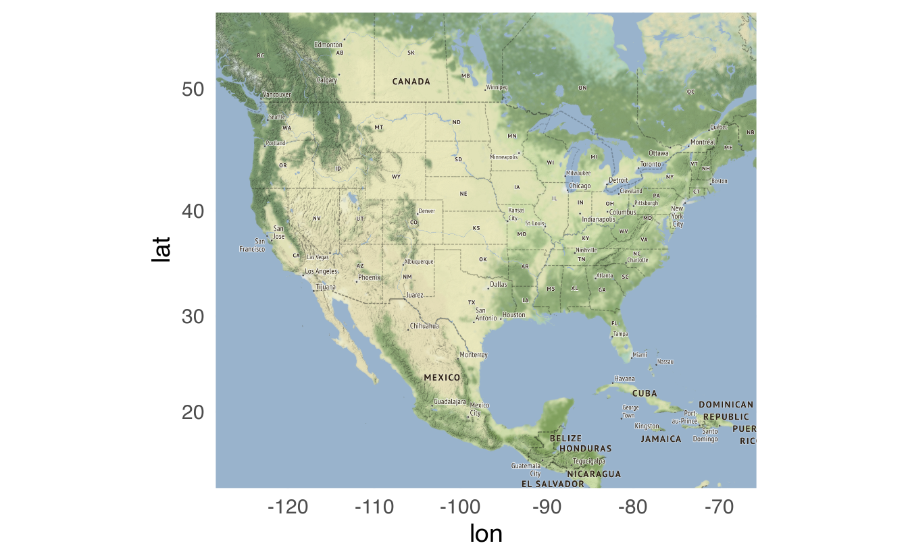

Whereas a map of Hyde Park would be small-scale:

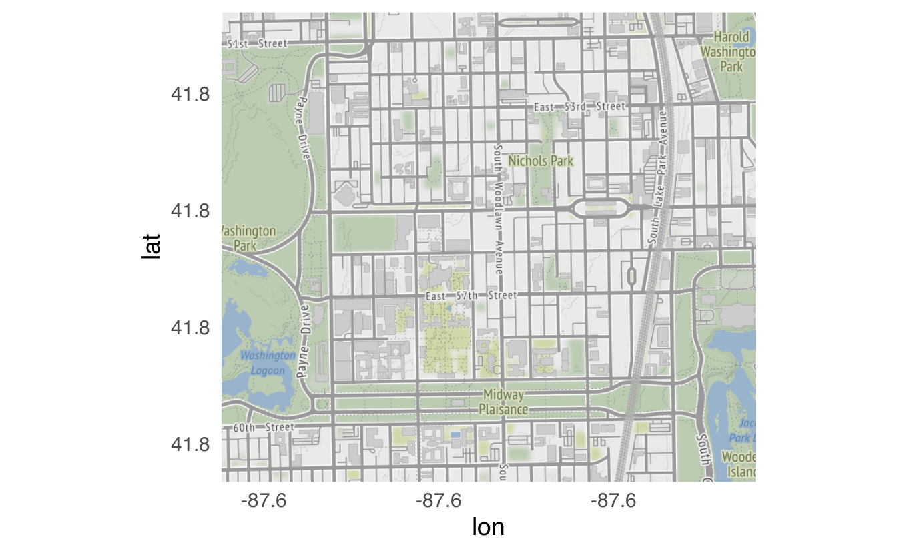

The smaller the scale, the easier it is to include additional details in the map.

#### Projection

**Projection** is the process of taking a globe (i.e. a three-dimensional object)^[Assuming you are not a [flat-Earther](https://www.livescience.com/24310-flat-earth-belief.html).] and visualizing it on a two-dimensional picture. There is no 100% perfect method for doing this, as any projection method will have to distort some features of the map to achieve a two-dimensional representation. There are five properties to consider when defining a projection method:

1. Shape
1. Area
1. Angles
1. Distance
1. Direction

Projection methods typically maximize the accuracy of one or two of these properties, but no more. For instance, **conformal projections** such as the **mercator** projection preserves shape and local angles and is very useful for sea navigation, but distorts the area of landmasses.


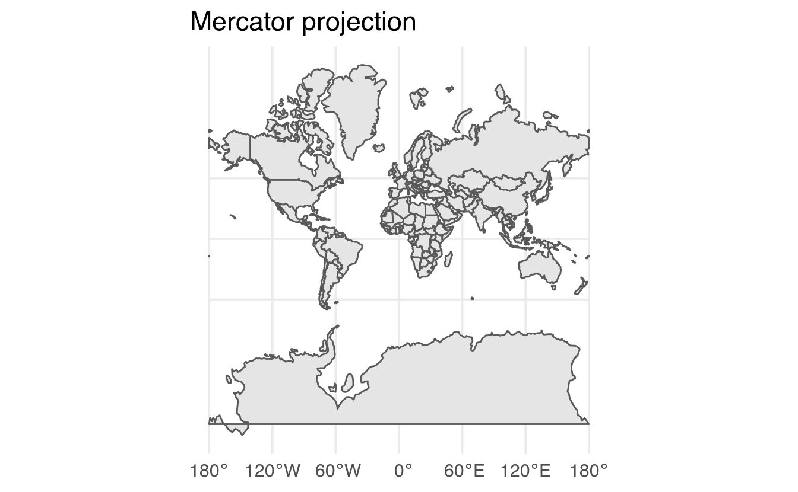

The farther away from the equator one travels, the more distorted the size of the region.

Another family of projections called **equal-area projections** preserves area ratios, so that the relative size of areas on a map are proportional to their areas on the Earth.

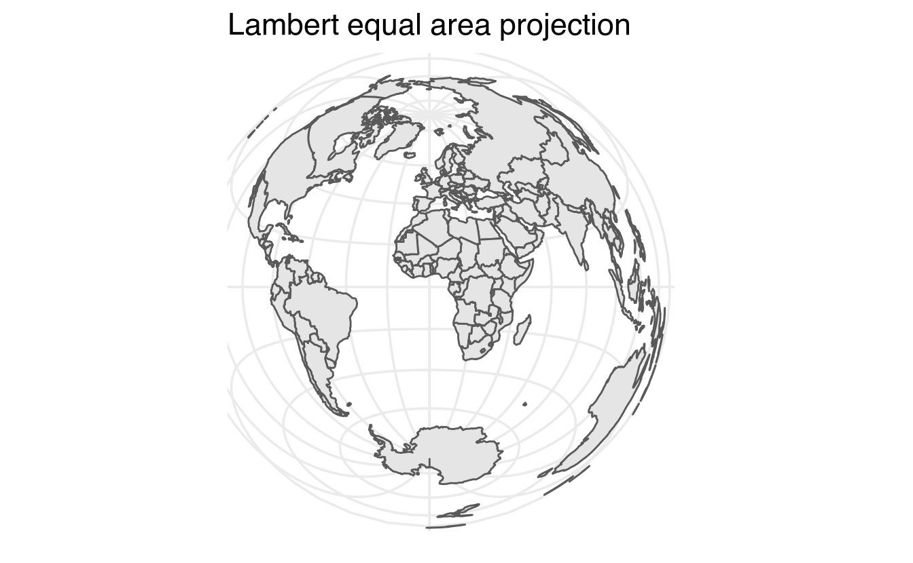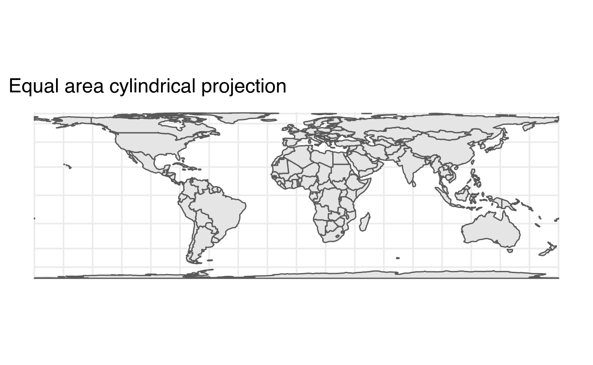

The downside is that equal-area projections tend to distory shapes heavily, so shapes of areas can become distorted. No method can be both conformal and equal-area simultaneously, but some methods such as the **Mollweide** projection achieve a trade-off between these sets of characteristics.

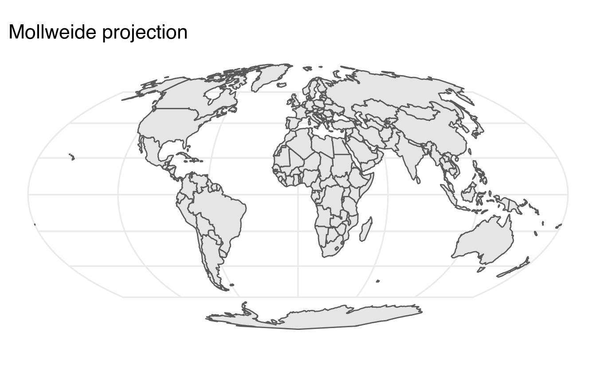

#### Symbols

Different types of symbols are used to denote different types of information on a spatial visualization. For instance, consider the following map of Hyde Park:

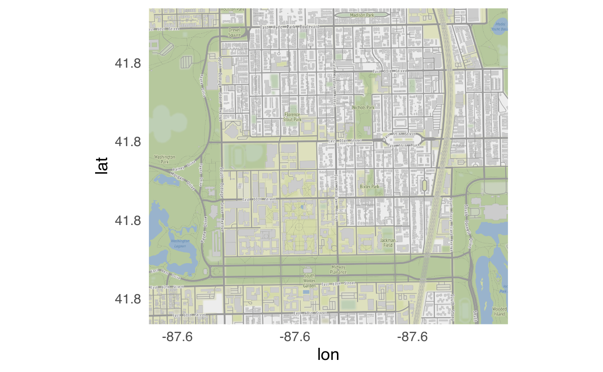

* Line are used to indicate roadways
* Fill is used to indicate type of land (grassland, water, urban, etc.)
* Symbols/shapes are used to locate buildings
* Text labels are used to indicate geographic locations

Data maps do not just encode geographic features on the visualization. They also plot quantitative and qualitative data on the mapping surface itself. Minard's drawing was not just of geographic coordinates and features - it also visualizes quantitative data such as troop deaths and temperature. Different symbols are used depending on the type of data you seek to visualize.

## Drawing raster maps with `ggmap`


[`ggmap`](https://github.com/dkahle/ggmap) is a package for R that retrieves raster map tiles from online mapping services like [Google Maps](https://www.google.com/maps) and plots them using the `ggplot2` framework. The map tiles are **raster** because they are static image files generated previously by the mapping service. You do not need any data files containing information on things like scale, projection, boundaries, etc. because that information is already created by the map tile. This severely limits your ability to redraw or change the appearance of the geographic map, however the tradeoff means you can immediately focus on incorporating additional data into the map.

\BeginKnitrBlock{rmdalert}<div class="rmdalert">Google has [changed its API requirements](https://developers.google.com/maps/documentation/geocoding/usage-and-billing), and **ggmap** users are now required to provide an API key *and* enable billing. I would not recommend trying to use Google Maps to obtain map images. The code below would work for you, but Google now charges you each time you obtain a map image. Stick to the other providers such as Stamen Maps.
</div>\EndKnitrBlock{rmdalert}

### Obtain map images

`ggmap` supports open-source map providers such as [OpenStreetMap](https://www.openstreetmap.org/) and [Stamen Maps](http://maps.stamen.com/#terrain/12/37.7706/-122.3782), as well as the proprietary Google Maps. Obtaining map tiles requires use of the `get_map()` function. There are two formats for specifying the mapping region you wish to obtain:

1. Bounding box
1. Center/zoom

### Specifying map regions

#### Bounding box

**Bounding box** requires the user to specify the four corners of the box defining the map region. For instance, to obtain a map of Chicago using Stamen Maps:


```r
# store bounding box coordinates
chi_bb <- c(left = -87.936287,
            bottom = 41.679835,
            right = -87.447052,
            top = 42.000835)

chicago_stamen <- get_stamenmap(bbox = chi_bb,
                                zoom = 11)
chicago_stamen
## 627x712 terrain map image from Stamen Maps. 
## See ?ggmap to plot it.
```

To view the map, use `ggmap()`:


```r
ggmap(chicago_stamen)
```

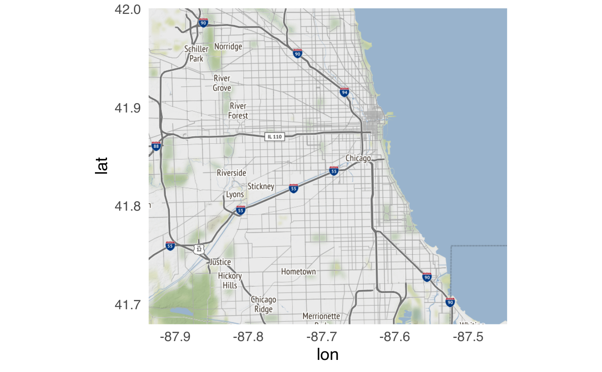

The `zoom` argument in `get_stamenmap()` controls the level of detail in the map. The larger the number, the greater the detail.


```r
get_stamenmap(bbox = chi_bb,
              zoom = 12) %>%
  ggmap()
```

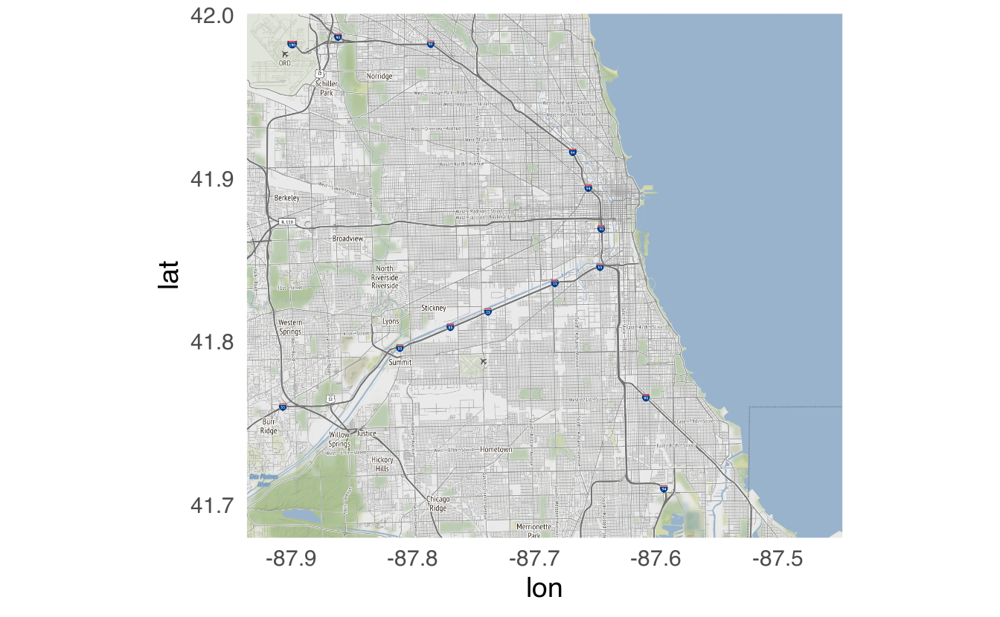

The smaller the number, the lesser the detail.


```r
get_stamenmap(bbox = chi_bb,
              zoom = 10) %>%
  ggmap()
```

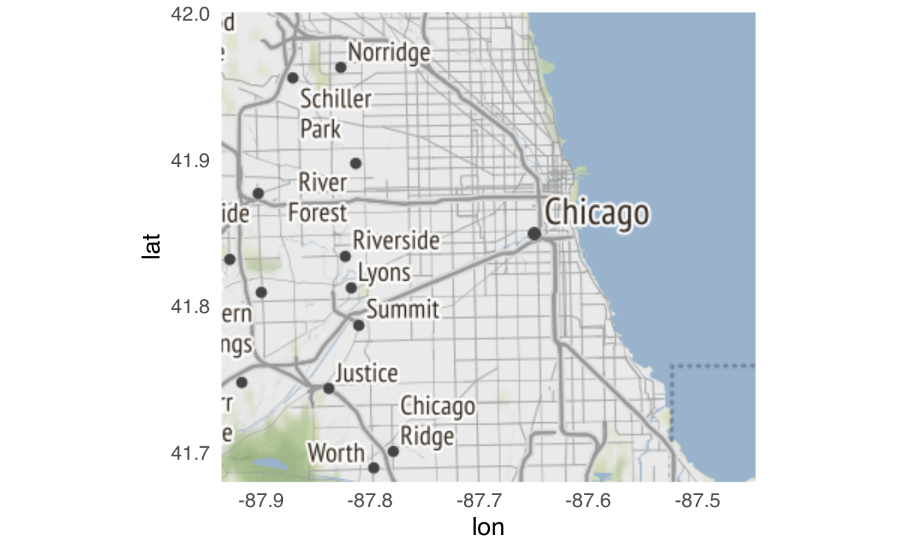

Trial and error will help you decide on the appropriate level of detail depending on what data you need to visualize on the map.

\BeginKnitrBlock{rmdnote}<div class="rmdnote">Use [bboxfinder.com](http://bboxfinder.com/#0.000000,0.000000,0.000000,0.000000) to determine the exact longitude/latitude coordinates for the bounding box you wish to obtain.
</div>\EndKnitrBlock{rmdnote}

#### Center/zoom

While Stamen Maps and OpenStreetMap require the bounding box format for obtaining map tiles and allow you to increase or decrease the level of detail within a single bounding box, Google Maps requires specifying the **center** coordinate of the map (a single longitude/latitude location) and the level of **zoom** or detail. `zoom` is an integer value from `3` (continent) to `21` (building). This means the level of detail is hardcoded to the size of the mapping region. The default `zoom` level is `10`.


```r
# store center coordinate
chi_center <- c(lon = -87.65, lat = 41.855)

chicago_google <- get_googlemap(center = chi_center)
ggmap(chicago_google)

get_googlemap(center = chi_center,
              zoom = 12) %>%
  ggmap()

get_googlemap(center = chi_center,
              zoom = 8) %>%
  ggmap()
```

\BeginKnitrBlock{rmdnote}<div class="rmdnote">Use [Find Latitude and Longitude](https://www.findlatitudeandlongitude.com/) to get the exact GPS coordinates of the center location.
</div>\EndKnitrBlock{rmdnote}

### Types of map tiles

Each map tile provider offers a range of different types of maps depending on the background you want for the map. Stamen Maps offers several different types:

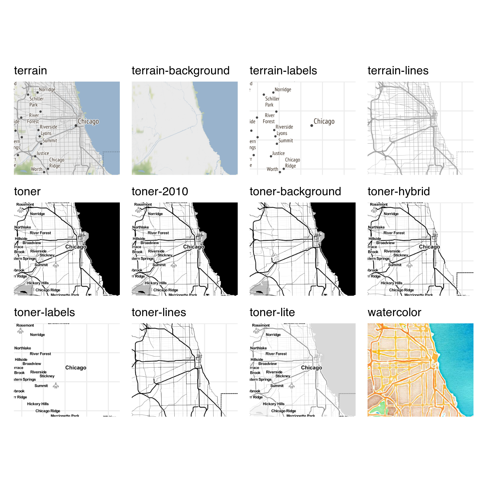

Google Maps is a bit more limited, but still offers a few major types:


See the documentation for the `get_*map()` function for the exact code necessary to get each type of map.

\BeginKnitrBlock{rmdnote}<div class="rmdnote">`get_map()` is a wrapper that automatically queries Google Maps, OpenStreetMap, or Stamen Maps depending on the function arguments and inputs. While useful, it also combines all the different arguments of `get_googlemap()`, `get_stamenmap()`, and `getopenstreetmap()` and can become a bit jumbled. Use at your own risk.
</div>\EndKnitrBlock{rmdnote}

### Import crime data

Now that we can obtain map tiles and draw them using `ggmap()`, let's explore how to add data to the map. The city of Chicago has [an excellent data portal](https://data.cityofchicago.org/) publishing a large volume of public records. Here we'll look at [crime data from 2017](https://data.cityofchicago.org/Public-Safety/Crimes-2017/d62x-nvdr).^[[Full documentation of the data from the larger 2001-present crime dataset.](https://data.cityofchicago.org/Public-Safety/Crimes-2001-to-present/ijzp-q8t2).] I previously downloaded a `.csv` file containing all the records, which I import using `read_csv()`:

\BeginKnitrBlock{rmdnote}<div class="rmdnote">If you are copying-and-pasting code from this demonstration, change this line of code to `crimes <- read_csv("https://cfss.uchicago.edu/data/Crimes_-_2017.csv")` to download the file from the course website.
</div>\EndKnitrBlock{rmdnote}


```r
crimes <- here("data", "Crimes_-_2017.csv") %>%
  read_csv()
glimpse(crimes)
## Rows: 267,345
## Columns: 22
## $ ID                     <dbl> 11094370, 11118031, 11134189, 11156462, 1116487…
## $ `Case Number`          <chr> "JA440032", "JA470589", "JA491697", "JA521389",…
## $ Date                   <chr> "09/21/2017 12:15:00 AM", "10/12/2017 07:14:00 …
## $ Block                  <chr> "072XX N CALIFORNIA AVE", "055XX W GRAND AVE", …
## $ IUCR                   <chr> "1122", "1345", "4651", "1110", "0265", "143A",…
## $ `Primary Type`         <chr> "DECEPTIVE PRACTICE", "CRIMINAL DAMAGE", "OTHER…
## $ Description            <chr> "COUNTERFEIT CHECK", "TO CITY OF CHICAGO PROPER…
## $ `Location Description` <chr> "CURRENCY EXCHANGE", "JAIL / LOCK-UP FACILITY",…
## $ Arrest                 <lgl> TRUE, TRUE, TRUE, TRUE, TRUE, TRUE, TRUE, TRUE,…
## $ Domestic               <lgl> FALSE, FALSE, FALSE, FALSE, FALSE, FALSE, FALSE…
## $ Beat                   <chr> "2411", "2515", "0922", "2514", "1221", "0232",…
## $ District               <chr> "024", "025", "009", "025", "012", "002", "005"…
## $ Ward                   <dbl> 50, 29, 12, 30, 32, 20, 9, 12, 12, 27, 32, 17, …
## $ `Community Area`       <dbl> 2, 19, 58, 19, 24, 40, 49, 30, 30, 23, 24, 44, …
## $ `FBI Code`             <chr> "10", "14", "26", "11", "02", "15", "03", "06",…
## $ `X Coordinate`         <dbl> 1156443, 1138788, 1159425, 1138653, 1161264, 11…
## $ `Y Coordinate`         <dbl> 1947707, 1913480, 1875711, 1920720, 1905292, 18…
## $ Year                   <dbl> 2017, 2017, 2017, 2017, 2017, 2017, 2017, 2017,…
## $ `Updated On`           <chr> "03/01/2018 03:52:35 PM", "03/01/2018 03:52:35 …
## $ Latitude               <dbl> 42.0, 41.9, 41.8, 41.9, 41.9, 41.8, 41.7, 41.8,…
## $ Longitude              <dbl> -87.7, -87.8, -87.7, -87.8, -87.7, -87.6, -87.6…
## $ Location               <chr> "(42.012293397, -87.699714109)", "(41.918711651…
```

Each row of the data frame is a single reported incident of crime. Geographic location is encoded in several ways, though most importantly for us the exact longitude and latitude of the incident is encoded in the `Longitude` and `Latitude` columns respectively.

### Plot high-level map of crime

Let's start with a simple high-level overview of reported crime in Chicago. First we need a map for the entire city.


```r
chicago <- chicago_stamen
ggmap(chicago)
```


### Using `geom_point()`

Since each row is a single reported incident of crime, we could use `geom_point()` to map the location of every crime in the dataset. Because `ggmap()` uses the map tiles (here, defined by `chicago`) as the basic input, we specify `data` and `mapping` inside of `geom_point()`, rather than inside `ggplot()`:


```r
ggmap(chicago) +
  geom_point(data = crimes,
             mapping = aes(x = Longitude,
                           y = Latitude))
```

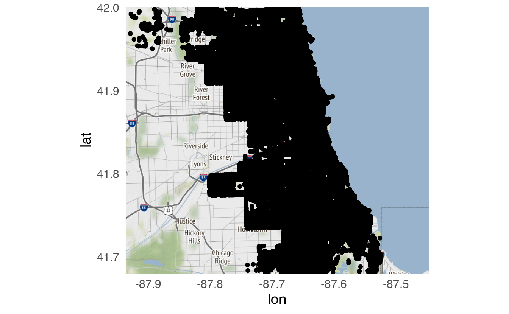

What went wrong? All we get is a sea of black.


```r
nrow(crimes)
## [1] 267345
```

Oh yeah. There were 267345 reported incidents of crime in the city. Each incident is represented by a dot on the map. How can we make this map more usable? One option is to decrease the size and increase the transparancy of each data point so dense clusters of crime become apparent:


```r
ggmap(chicago) +
  geom_point(data = crimes,
             aes(x = Longitude,
                 y = Latitude),
             size = .25,
             alpha = .01)
```

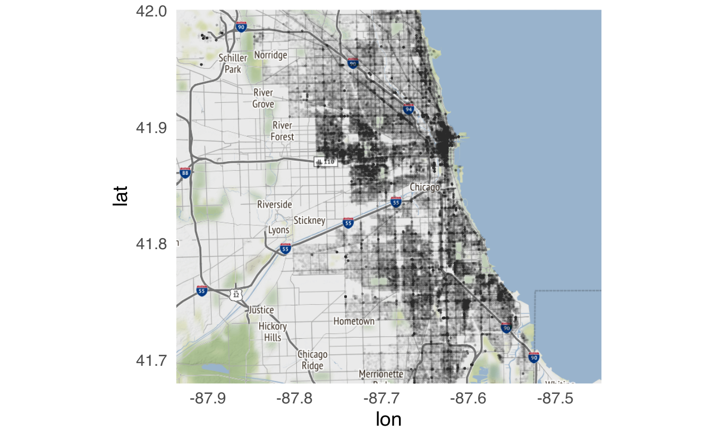

Better, but still not quite as useful as it could be.

### Using `stat_density_2d()`

Instead of relying on `geom_point()` and plotting the raw data, a better approach is to create a **heatmap**. More precisely, this will be a two-dimensional kernel density estimation (KDE). In this context, KDE will take all the raw data (i.e. reported incidents of crime) and convert it into a smoothed plot showing geographic concentrations of crime. The core function in `ggplot2` to generate this kind of plot is `geom_density_2d()`:


```r
ggmap(chicago) +
  geom_density_2d(data = crimes,
                  aes(x = Longitude,
                      y = Latitude))
```

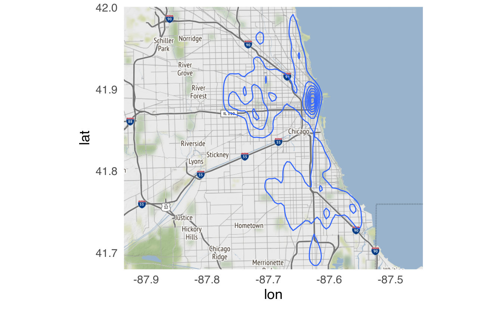

By default, `geom_density_2d()` draws a [**contour plot**](https://en.wikipedia.org/wiki/Contour_line) with lines of constant value. That is, each line represents approximately the same frequency of crime all along that specific line. Contour plots are frequently used in maps (known as **topographic maps**) to denote elevation.

<div class="figure" style="text-align: center">

<p class="caption">(\#fig:contour-plot)The Cadillac Mountains. Source: [US Geological Survey](https://www.usgs.gov/media/images/cadillacmountainss).</p>
</div>

Rather than drawing lines, instead we can fill in the graph so that we use the `fill` aesthetic to draw bands of crime density. To do that, we use the related function `stat_density_2d()`:


```r
ggmap(chicago) +
  stat_density_2d(data = crimes,
                  aes(x = Longitude,
                      y = Latitude,
                      fill = stat(level)),
                  geom = "polygon")
```

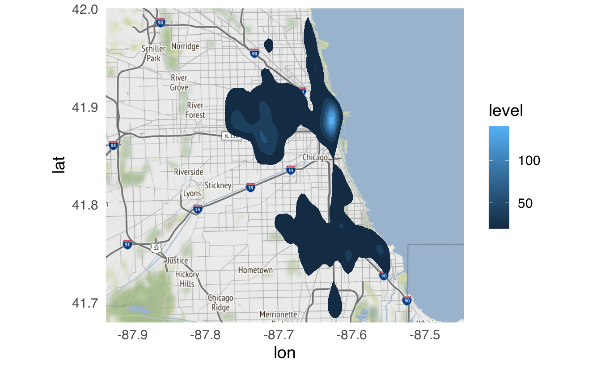

Note the two new arguments:

* `geom = "polygon"` - change the [geometric object](/notes/grammar-of-graphics/#geometric-objects) to be drawn from a `density_2d` geom to a `polygon` geom
* `fill = stat(level)` - the value for the `fill` aesthetic is the `level` calculated within `stat_density_2d()`, which we access using the `stat()` notation.

This is an improvement, but we can adjust some additional settings to make the graph visually more useful. Specifically,

* Increase the number of `bins`, or unique bands of color allowed on the graph
* Make the heatmap semi-transparent using `alpha` so we can still view the underlying map
* Change the color palette to better distinguish between high and low crime areas. Here I use `brewer.pal()` from the `RColorBrewer` package to create a custom color palette using reds and yellows.


```r
ggmap(chicago) +
  stat_density_2d(data = crimes,
                  aes(x = Longitude,
                      y = Latitude,
                      fill = stat(level)),
                  alpha = .2,
                  bins = 25,
                  geom = "polygon") +
  scale_fill_gradientn(colors = brewer.pal(7, "YlOrRd"))
```

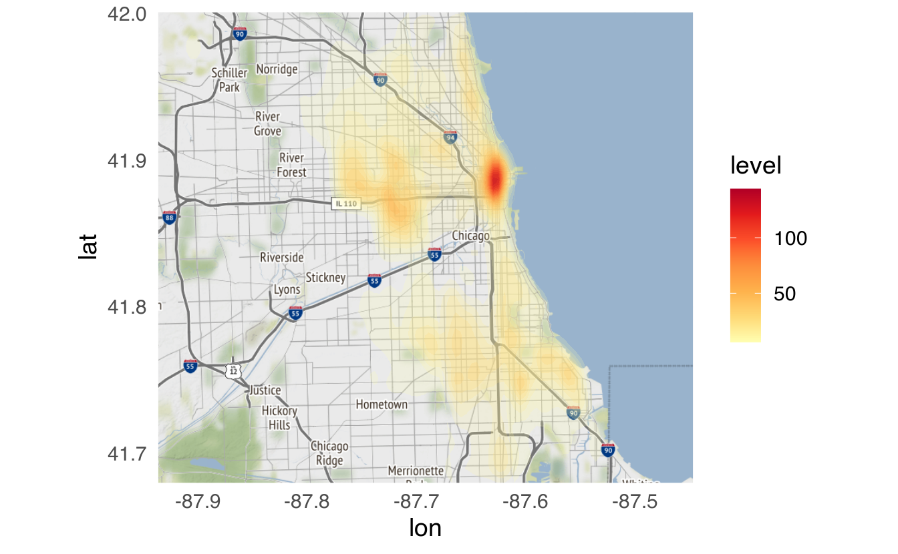

From this map, a couple trends are noticeable:

* The downtown region has the highest crime incidence rate. Not surprising given its population density during the workday.
* There are clusters of crime on the south and west sides. Also not surprising if you know anything about the city of Chicago.

### Looking for variation

Because `ggmap` is built on `ggplot2`, we can use the core features of `ggplot2` to modify the graph. One major feature is faceting. Let's focus our analysis on four types of crimes with similar frequency of reported incidents^[Specifically burglary, motor vehicle theft, narcotics, and robbery.] and facet by type of crime:


```r
ggmap(chicago) +
  stat_density_2d(data = crimes %>%
                    filter(`Primary Type` %in% c("BURGLARY", "MOTOR VEHICLE THEFT",
                                                 "NARCOTICS", "ROBBERY")),
                  aes(x = Longitude,
                      y = Latitude,
                      fill = stat(level)),
                  alpha = .4,
                  bins = 10,
                  geom = "polygon") +
  scale_fill_gradientn(colors = brewer.pal(7, "YlOrRd")) +
  facet_wrap(~ `Primary Type`)
```

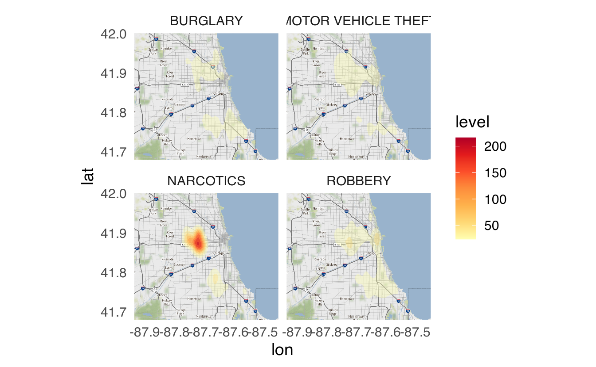

There is a large difference in the geographic density of narcotics crimes relative to the other catgories. While burglaries, motor vehicle thefts, and robberies are reasonably prevalent all across the city, the vast majority of narcotics crimes occur in the west and south sides of the city.

### Locations of murders

While `geom_point()` was not appropriate for graphing a large number of observations in a dense geographic location, it does work rather well for less dense areas. Now let's limit our analysis strictly to reported incidents of homicide in 2017.


```r
(homicides <- crimes %>%
  filter(`Primary Type` == "HOMICIDE"))
## # A tibble: 671 × 22
##          ID `Case Number` Date            Block IUCR  `Primary Type` Description
##       <dbl> <chr>         <chr>           <chr> <chr> <chr>          <chr>      
##  1    23128 JA149608      02/11/2017 07:… 001X… 0110  HOMICIDE       FIRST DEGR…
##  2    23851 JA530946      11/30/2017 11:… 088X… 0110  HOMICIDE       FIRST DEGR…
##  3    23355 JA302423      06/11/2017 06:… 047X… 0110  HOMICIDE       FIRST DEGR…
##  4    23379 JA312425      06/18/2017 04:… 006X… 0110  HOMICIDE       FIRST DEGR…
##  5    23673 JA490016      10/28/2017 10:… 048X… 0110  HOMICIDE       FIRST DEGR…
##  6    23224 JA210752      04/03/2017 12:… 013X… 0110  HOMICIDE       FIRST DEGR…
##  7    23627 JA461918      10/07/2017 11:… 018X… 0110  HOMICIDE       FIRST DEGR…
##  8    23628 JA461918      10/07/2017 11:… 018X… 0110  HOMICIDE       FIRST DEGR…
##  9 10836558 JA138326      02/01/2017 06:… 013X… 0142  HOMICIDE       RECKLESS H…
## 10    23477 JA364517      07/26/2017 05:… 047X… 0110  HOMICIDE       FIRST DEGR…
## # … with 661 more rows, and 15 more variables: `Location Description` <chr>,
## #   Arrest <lgl>, Domestic <lgl>, Beat <chr>, District <chr>, Ward <dbl>,
## #   `Community Area` <dbl>, `FBI Code` <chr>, `X Coordinate` <dbl>,
## #   `Y Coordinate` <dbl>, Year <dbl>, `Updated On` <chr>, Latitude <dbl>,
## #   Longitude <dbl>, Location <chr>
```

We can draw a map of the city with all homicides indicated on the map using `geom_point()`:


```r
ggmap(chicago) +
  geom_point(data = homicides,
             mapping = aes(x = Longitude,
                           y = Latitude),
             size = 1)
```

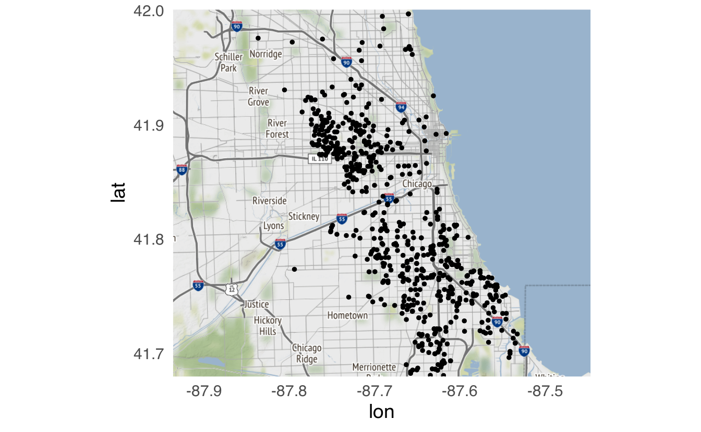

Compared to our previous overviews, few if any homicides are reported downtown. We can also narrow down the geographic location to map specific neighborhoods in Chicago. First we obtain map tiles for those specific regions. Here we'll examine North Lawndale and Kenwood.


```r
# North Lawndale is the highest homicides in 2017
# Compare to Kenwood
north_lawndale_bb <- c(
  left = -87.749047,
  bottom = 41.840185,
  right = -87.687893,
  top = 41.879850
)
north_lawndale <- get_stamenmap(bbox = north_lawndale_bb,
                                zoom = 14)

kenwood_bb <- c(
  left = -87.613113,
  bottom = 41.799215,
  right = -87.582536,
  top = 41.819064
)
kenwood <- get_stamenmap(bbox = kenwood_bb,
                                zoom = 15)

ggmap(north_lawndale)
```


```r
ggmap(kenwood)
```

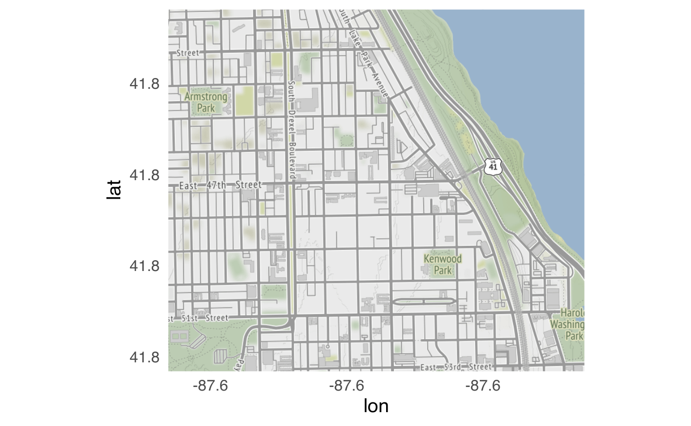

To plot homicides specifically in these neighborhoods, change `ggmap(chicago)` to the appropriate map tile:


```r
ggmap(north_lawndale) +
  geom_point(data = homicides,
             aes(x = Longitude, y = Latitude))
```

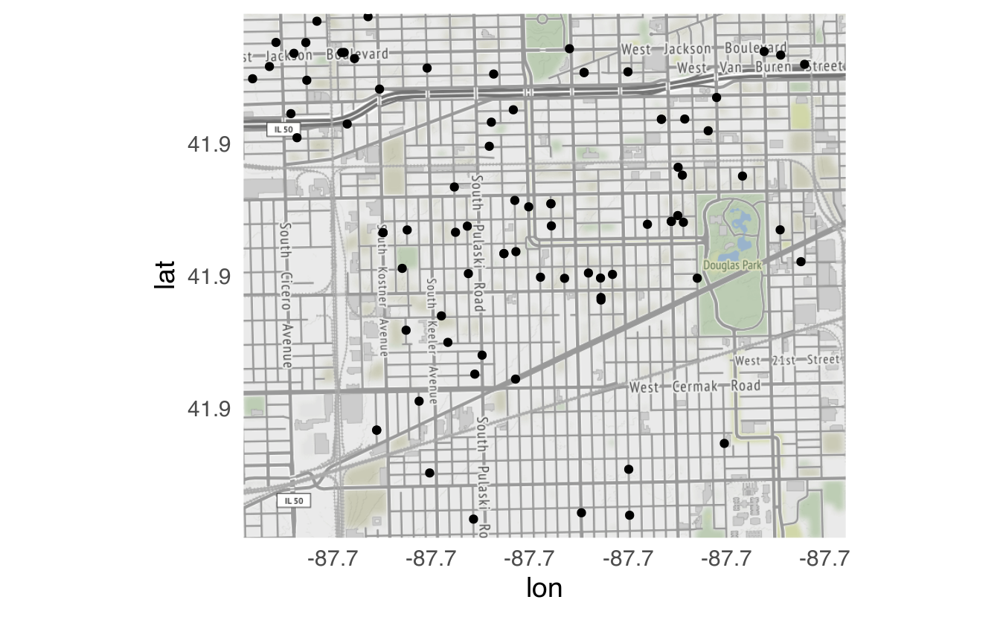

```r

ggmap(kenwood) +
  geom_point(data = homicides,
             aes(x = Longitude, y = Latitude))
```

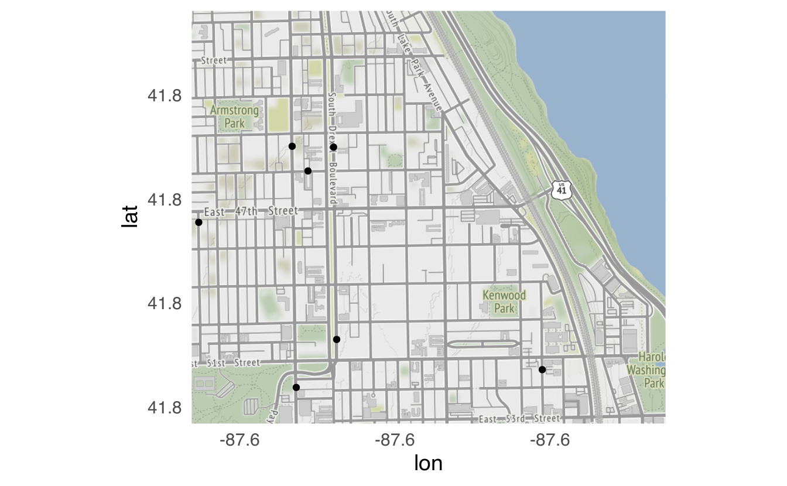

North Lawndale had the most reported homicides in 2017, whereas Kenwood had only a handful. And even though `homicides` contained data for homicides across the entire city, `ggmap()` automatically cropped the graph to keep just the homicides that occurred within the bounding box.

All the other aesthetic customizations of `geom_point()` work with `ggmap`. So we could expand these neighborhood maps to include all violent crime categories^[Specifcally homicides, criminal sexual assault, and robbery. [Aggravated assault and aggravated robbery are also defined as violent crimes by the Chicago Police Departmant](http://gis.chicagopolice.org/clearmap_crime_sums/crime_types.html), but the coding system for this data set does not distinguish between ordinary and aggravated types of assault and robbery.] and distinguish each type by `color`:


```r
(violent <- crimes %>%
  filter(`Primary Type` %in% c("HOMICIDE",
                               "CRIM SEXUAL ASSAULT",
                               "ROBBERY")))
## # A tibble: 14,146 × 22
##          ID `Case Number` Date            Block IUCR  `Primary Type` Description
##       <dbl> <chr>         <chr>           <chr> <chr> <chr>          <chr>      
##  1 11164874 JA531910      12/01/2017 06:… 022X… 0265  CRIM SEXUAL A… AGGRAVATED…
##  2 10995008 JA322389      06/25/2017 07:… 003X… 031A  ROBBERY        ARMED: HAN…
##  3 11175304 JA545986      12/11/2017 07:… 007X… 031A  ROBBERY        ARMED: HAN…
##  4 11175934 JA546734      12/12/2017 06:… 007X… 031A  ROBBERY        ARMED: HAN…
##  5 11227287 JB147188      10/08/2017 03:… 092X… 0281  CRIM SEXUAL A… NON-AGGRAV…
##  6 11227634 JB147599      08/26/2017 10:… 001X… 0281  CRIM SEXUAL A… NON-AGGRAV…
##  7    23128 JA149608      02/11/2017 07:… 001X… 0110  HOMICIDE       FIRST DEGR…
##  8 11043709 JA378592      08/05/2017 03:… 038X… 0313  ROBBERY        ARMED: OTH…
##  9 11170225 JA538651      12/06/2017 09:… 092X… 031A  ROBBERY        ARMED: HAN…
## 10 11228964 JB149656      12/24/2017 02:… 005X… 0330  ROBBERY        AGGRAVATED 
## # … with 14,136 more rows, and 15 more variables: `Location Description` <chr>,
## #   Arrest <lgl>, Domestic <lgl>, Beat <chr>, District <chr>, Ward <dbl>,
## #   `Community Area` <dbl>, `FBI Code` <chr>, `X Coordinate` <dbl>,
## #   `Y Coordinate` <dbl>, Year <dbl>, `Updated On` <chr>, Latitude <dbl>,
## #   Longitude <dbl>, Location <chr>
```


```r
ggmap(north_lawndale) +
  geom_point(data = violent,
             aes(x = Longitude, y = Latitude,
                 color = `Primary Type`)) +
  scale_color_brewer(type = "qual", palette = "Dark2")
```

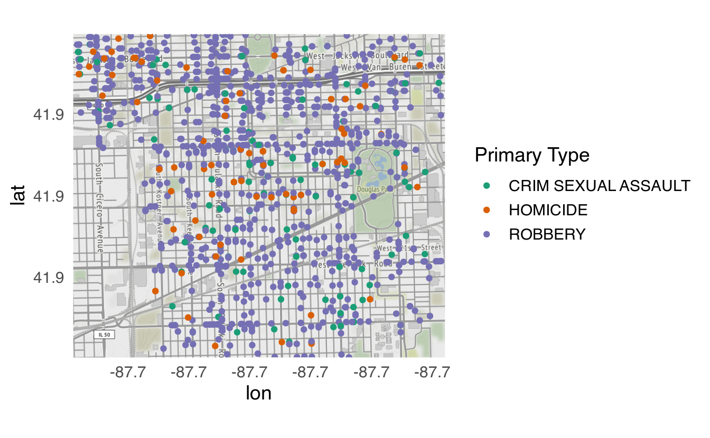

```r

ggmap(kenwood) +
  geom_point(data = violent,
             aes(x = Longitude, y = Latitude,
                 color = `Primary Type`)) +
  scale_color_brewer(type = "qual", palette = "Dark2")
```

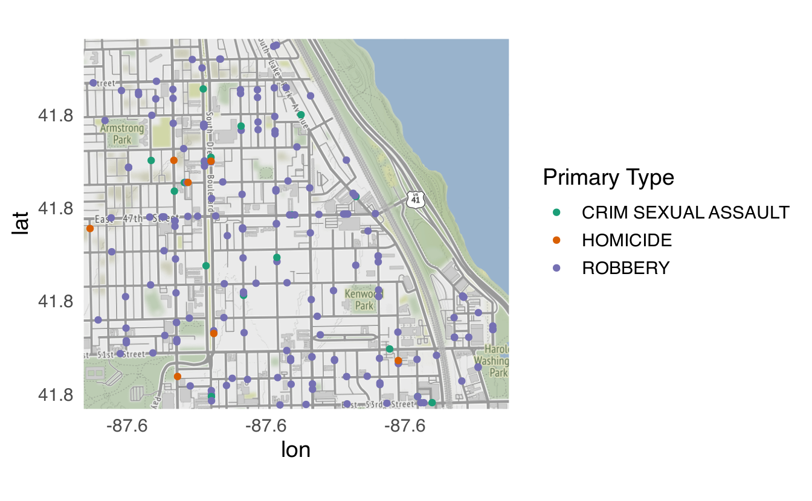

## Exercise: Chicago 311 data

The city of Chicago has [an excellent data portal](https://data.cityofchicago.org/) publishing a large volume of public records. Here we'll look at a subset of the [311 service requests](https://data.cityofchicago.org/Service-Requests/311-Service-Requests/v6vf-nfxy). I used `RSocrata` and the data portal's [API](/notes/application-program-interface/) to retrieve a portion of the data set.

\BeginKnitrBlock{rmdnote}<div class="rmdnote">Download the necessary data files for the following coding exercises using `usethis::use_course("css-data-mining-viz/geoviz")`.
</div>\EndKnitrBlock{rmdnote}


```r
chi_311 <- read_csv("data/chi-311.csv")
```


```r
glimpse(chi_311)
## Rows: 167,552
## Columns: 8
## $ sr_number      <chr> "SR19-01209373", "SR19-01129184", "SR19-01130159", "SR1…
## $ sr_type        <chr> "Dead Animal Pick-Up Request", "Dead Animal Pick-Up Req…
## $ sr_short_code  <chr> "SGQ", "SGQ", "SGQ", "SGQ", "SGQ", "SGQ", "SGQ", "SGQ",…
## $ created_date   <dttm> 2019-03-23 17:13:05, 2019-03-09 01:37:26, 2019-03-09 1…
## $ community_area <dbl> 58, 40, 40, 67, 59, 59, 2, 59, 59, 64, 59, 25, 25, 59, …
## $ ward           <dbl> 12, 20, 20, 17, 12, 12, 40, 12, 12, 13, 12, 29, 28, 12,…
## $ latitude       <dbl> 41.8, 41.8, 41.8, 41.8, 41.8, 41.8, 42.0, 41.8, 41.8, 4…
## $ longitude      <dbl> -87.7, -87.6, -87.6, -87.7, -87.7, -87.7, -87.7, -87.7,…
```

### Visualize the 311 data

1. Obtain map tiles using `ggmap` for the city of Chicago.

    <details> 
      <summary>Click for the solution</summary>
      <p>
    
    
    ```r
    # store bounding box coordinates
    chi_bb <- c(left = -87.936287,
                bottom = 41.679835,
                right = -87.447052,
                top = 42.000835)
    
    # retrieve bounding box
    chicago <- get_stamenmap(bbox = chi_bb,
                             zoom = 11)
    
    # plot the raster map
    ggmap(chicago)
    ```
    
    
        
      </p>
    </details>

1. Generate a scatterplot of complaints about potholes in streets.

    <details> 
      <summary>Click for the solution</summary>
      <p>
    
    
    ```r
    # initialize map
    ggmap(chicago) +
      # add layer with scatterplot
      # use alpha to show density of points
      geom_point(data = filter(chi_311, sr_type == "Pothole in Street Complaint"),
                 mapping = aes(x = longitude,
                               y = latitude),
                 size = .25,
                 alpha = .05)
    ```
    
    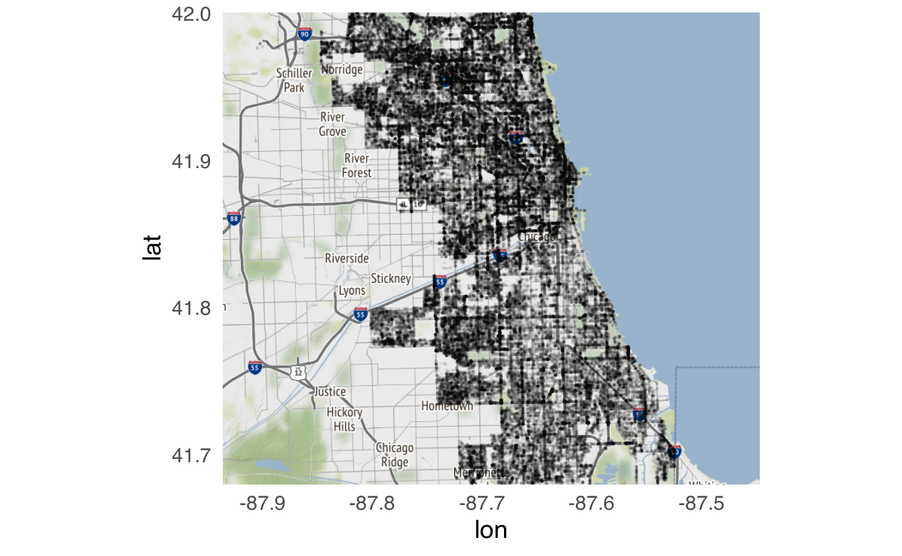
        
      </p>
    </details>

1. Generate a heatmap of complaints about potholes in streets. Do you see any unusual patterns or clusterings?

    <details> 
      <summary>Click for the solution</summary>
      <p>
    
    
    ```r
    # initialize the map
    ggmap(chicago) +
      # add the heatmap
      stat_density_2d(data = filter(chi_311, sr_type == "Pothole in Street Complaint"),
                      mapping = aes(x = longitude,
                                    y = latitude,
                                    fill = stat(level)),
                      alpha = .1,
                      bins = 50,
                      geom = "polygon") +
      # customize the color gradient
      scale_fill_gradientn(colors = brewer.pal(9, "YlOrRd"))
    ```
    
    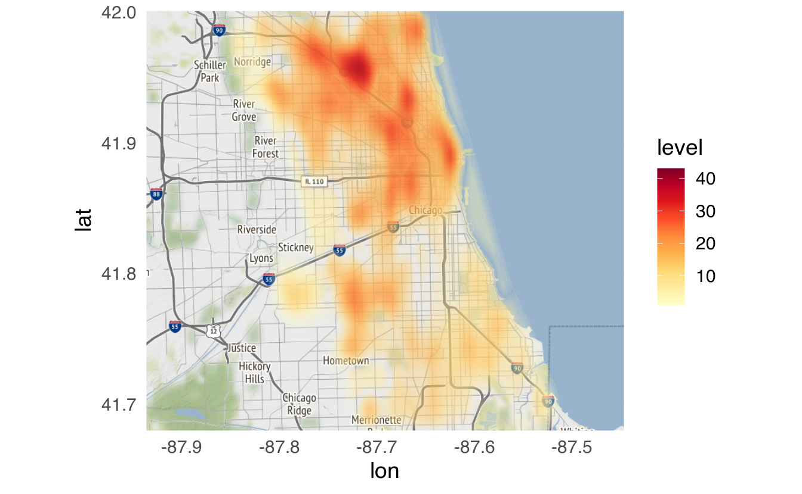
        
    Seems to be clustered on the north side. Also looks to occur along major arterial routes for commuting traffic. Makes sense because they receive the most wear and tear.
        
      </p>
    </details>

1. Obtain map tiles for Hyde Park.

    <details> 
      <summary>Click for the solution</summary>
      <p>
    
    
    ```r
    # store bounding box coordinates
    hp_bb <- c(left = -87.608221,
               bottom = 41.783249,
               right = -87.577643,
               top = 41.803038)
    
    # retrieve bounding box
    hyde_park <- get_stamenmap(bbox = hp_bb,
                               zoom = 15)
    
    # plot the raster map
    ggmap(hyde_park)
    ```
    
    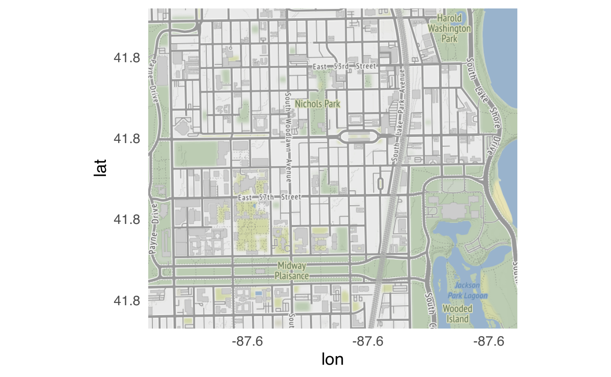
        
      </p>
    </details>

1. Generate a scatterplot of requests to pick up dead animals in Hyde Park.

    <details> 
      <summary>Click for the solution</summary>
      <p>
    
    
    ```r
    # initialize the map
    ggmap(hyde_park) +
      # add a scatterplot layer
      geom_point(data = filter(chi_311, sr_type == "Dead Animal Pick-Up Request"),
                 mapping = aes(x = longitude,
                               y = latitude))
    ```
    
    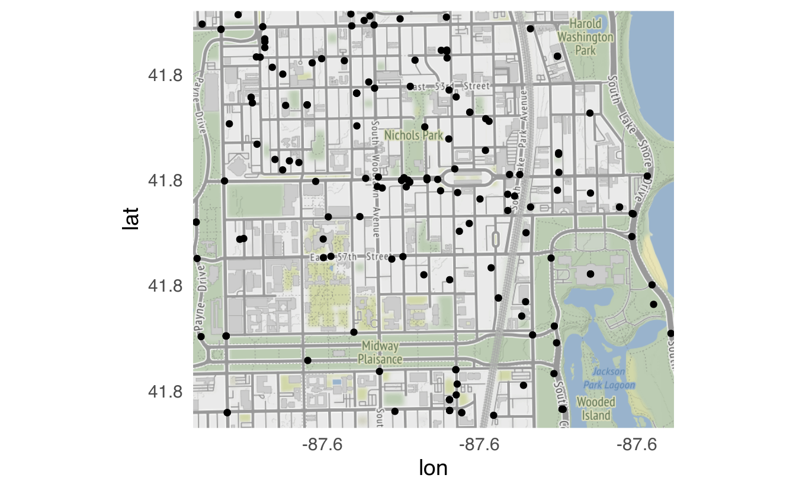
        
      </p>
    </details>

## Importing spatial data files using `sf`

Rather than storing spatial data as raster image files which are not easily modifiable, we can instead store spatial data  as **vector** files. Vector files store the underlying geographical features (e.g. points, lines, polygons) as numerical data which software such as R can import and use to draw a map.

There are [many popular file formats for storing spatial data.](https://en.wikipedia.org/wiki/GIS_file_formats#Popular_GIS_file_formats) Here we will look at two common file types, **shapefiles** and **GeoJSON**.

## File formats

### Shapefile

**Shapefiles** are a commonly supported file type for spatial data dating back to the early 1990s. Proprietary software for geographic information systems (GIS) such as [ArcGIS](https://www.esri.com/en-us/arcgis/about-arcgis/overview) pioneered this format and helps maintain its continued usage. A shapefile encodes points, lines, and polygons in geographic space, and is actually a set of files. Shapefiles appear with a `.shp` extension, sometimes with accompanying files ending in `.dbf` and `.prj`.

* `.shp` stores the geographic coordinates of the geographic features (e.g. country, state, county)
* `.dbf` stores data associated with the geographic features (e.g. unemployment rate, crime rates, percentage of votes cast for Donald Trump)
* `.prj` stores information about the projection of the coordinates in the shapefile

When importing a shapefile, you need to ensure all the files are in the same folder. For example, here is the structure of the [Census Bureau's 2013 state boundaries shapefile](https://www.census.gov/cgi-bin/geo/shapefiles/index.php):


```
## -- cb_2013_us_county_20m.dbf
## -- cb_2013_us_county_20m.prj
## -- cb_2013_us_county_20m.shp
## -- cb_2013_us_county_20m.shp.iso.xml
## -- cb_2013_us_county_20m.shp.xml
## -- cb_2013_us_county_20m.shx
## -- county_20m.ea.iso.xml
```

**This is the complete shapefile.** If any of these files are missing, you will get an error importing your shapefile:

```
## Error in CPL_read_ogr(dsn, layer, query, as.character(options), quiet, : Open failed.
```

### GeoJSON

**GeoJSON** is a newer format for encoding a variety of geographical data structures using the **J**ava**S**cript **O**bject **N**otation (JSON) file format. JSON formatted data is frequently used in web development and services. We will explore it in more detail when we get to [collecting data from the web.](/notes/write-an-api-function/#intro-to-json-and-xml) An example of a GeoJSON file is below:

```json
{
  "type": "Feature",
  "geometry": {
    "type": "Point",
    "coordinates": [125.6, 10.1]
  },
  "properties": {
    "name": "Dinagat Islands"
  }
}
```

GeoJSON files are plain text files and can contain many different types of geometric features.

## Simple features

[There are a crap ton of packages for R that allow you to interact with shapefiles and spatial data.](https://cran.r-project.org/web/views/Spatial.html) Here we will focus on a modern package for reading and transforming spatial data in a tidy format. [Simple features](https://en.wikipedia.org/wiki/Simple_Features) or [**simple feature access**](http://www.opengeospatial.org/standards/sfa) refers to a formal standard that describes how objects in the real world can be represented in computers, with emphasis on the **spatial** geometry of these objects. It also describes how such objects can be stored in and retrieved from databases, and which geometrical operations should be defined for them.

The standard is widely implemented in spatial databases (such as PostGIS), commercial GIS (e.g., [ESRI ArcGIS](http://www.esri.com/)) and forms the vector data basis for libraries such as [GDAL](http://www.gdal.org/). A subset of simple features forms the [GeoJSON](http://geojson.org/) standard.

R has well-supported classes for storing spatial data ([`sp`](https://CRAN.R-project.org/package=sp)) and interfacing to the above mentioned environments ([`rgdal`](https://CRAN.R-project.org/package=rgdal), [`rgeos`](https://CRAN.R-project.org/package=rgeos)), but has so far lacked a complete implementation of simple features, making conversions at times convoluted, inefficient or incomplete. The [`sf`](http://github.com/r-spatial/sf) package tries to fill this gap.

### What is a feature?

A **feature** is a thing or an object in the real world. Often features will consist of a set of features. For instance, a tree can be a feature but a set of trees can form a forest which is itself a feature. Features have **geometry** describing where on Earth the feature is located. They also have attributes, which describe other properties of the feature.

### Dimensions

All geometries are composed of points. Points are coordinates in a 2-, 3- or 4-dimensional space. All points in a geometry have the same dimensionality. In addition to X and Y coordinates, there are two optional additional dimensions:

* a Z coordinate, denoting altitude
* an M coordinate (rarely used), denoting some **measure** that is associated with the point, rather than with the feature as a whole (in which case it would be a feature attribute); examples could be time of measurement, or measurement error of the coordinates

The four possible cases then are:

1. two-dimensional points refer to x and y, easting and northing, or longitude and latitude, we refer to them as XY
2. three-dimensional points as XYZ
3. three-dimensional points as XYM
4. four-dimensional points as XYZM (the third axis is Z, fourth M)

### Simple feature geometry types

The following seven simple feature types are the most common, and are for instance the only ones used for [GeoJSON](https://tools.ietf.org/html/rfc7946):

| type | description                                        |
| ---- | -------------------------------------------------- |
| `POINT` | zero-dimensional geometry containing a single point |
| `LINESTRING` | sequence of points connected by straight, non-self intersecting line pieces; one-dimensional geometry |
| `POLYGON` | geometry with a positive area (two-dimensional); sequence of points form a closed, non-self intersecting ring; the first ring denotes the exterior ring, zero or more subsequent rings denote holes in this exterior ring |
| `MULTIPOINT` | set of points; a MULTIPOINT is simple if no two Points in the MULTIPOINT are equal |
| `MULTILINESTRING` | set of linestrings |
| `MULTIPOLYGON` | set of polygons |
| `GEOMETRYCOLLECTION` | set of geometries of any type except GEOMETRYCOLLECTION |

### Coordinate reference system

Coordinates can only be placed on the Earth's surface when their coordinate reference system (CRS) is known; this may be an spheroid CRS such as WGS84, a projected, two-dimensional (Cartesian) CRS such as a UTM zone or Web Mercator, or a CRS in three-dimensions, or including time. Similarly, M-coordinates need an attribute reference system, e.g. a [measurement unit](https://CRAN.R-project.org/package=units).

## Simple features in R

`sf` stores simple features as basic R data structures (lists, matrix, vectors, etc.). The typical data structure stores geometric and feature attributes as a data frame with one row per feature. However since feature geometries are not single-valued, they are put in a **list-column** with each list element holding the simple feature geometry of that feature.

### Importing spatial data using `sf`

`st_read()` imports a spatial data file and converts it to a simple feature data frame. Here we import a shapefile containing the spatial boundaries of each [community area in the city of Chicago](https://data.cityofchicago.org/Facilities-Geographic-Boundaries/Boundaries-Community-Areas-current-/cauq-8yn6).


```r
chi_shape <- here("data/Boundaries - Community Areas (current)/geo_export_328cdcbf-33ba-4997-8ce8-90953c6fec19.shp") %>%
  st_read()
## Reading layer `geo_export_328cdcbf-33ba-4997-8ce8-90953c6fec19' from data source `/Users/soltoffbc/Projects/Data Visualization/course-notes/data/Boundaries - Community Areas (current)/geo_export_328cdcbf-33ba-4997-8ce8-90953c6fec19.shp' 
##   using driver `ESRI Shapefile'
## Simple feature collection with 77 features and 9 fields
## Geometry type: MULTIPOLYGON
## Dimension:     XY
## Bounding box:  xmin: -87.9 ymin: 41.6 xmax: -87.5 ymax: 42
## Geodetic CRS:  WGS84(DD)
```

The short report printed gives the file name, mentions that there are 77 features (records, represented as rows) and 10 fields (attributes, represented as columns), states that the spatial data file is a `MULTIPOLYGON`, provides the bounding box coordinates, and identifies the projection method (which we will discuss later). If we print the first rows of `chi_shape`:


```r
chi_shape
## Simple feature collection with 77 features and 9 fields
## Geometry type: MULTIPOLYGON
## Dimension:     XY
## Bounding box:  xmin: -87.9 ymin: 41.6 xmax: -87.5 ymax: 42
## Geodetic CRS:  WGS84(DD)
## First 10 features:
##    perimeter       community shape_len shape_area area comarea area_numbe
## 1          0         DOUGLAS     31027   46004621    0       0         35
## 2          0         OAKLAND     19566   16913961    0       0         36
## 3          0     FULLER PARK     25339   19916705    0       0         37
## 4          0 GRAND BOULEVARD     28197   48492503    0       0         38
## 5          0         KENWOOD     23325   29071742    0       0         39
## 6          0  LINCOLN SQUARE     36625   71352328    0       0          4
## 7          0 WASHINGTON PARK     28175   42373881    0       0         40
## 8          0       HYDE PARK     29747   45105380    0       0         41
## 9          0        WOODLAWN     46937   57815180    0       0         42
## 10         0     ROGERS PARK     34052   51259902    0       0          1
##    area_num_1 comarea_id                       geometry
## 1          35          0 MULTIPOLYGON (((-87.6 41.8,...
## 2          36          0 MULTIPOLYGON (((-87.6 41.8,...
## 3          37          0 MULTIPOLYGON (((-87.6 41.8,...
## 4          38          0 MULTIPOLYGON (((-87.6 41.8,...
## 5          39          0 MULTIPOLYGON (((-87.6 41.8,...
## 6           4          0 MULTIPOLYGON (((-87.7 42, -...
## 7          40          0 MULTIPOLYGON (((-87.6 41.8,...
## 8          41          0 MULTIPOLYGON (((-87.6 41.8,...
## 9          42          0 MULTIPOLYGON (((-87.6 41.8,...
## 10          1          0 MULTIPOLYGON (((-87.7 42, -...
```

In the output we see:

* Each row is a simple feature: a single record, or `data.frame` row, consisting of attributes and geometry
* The `geometry` column is a simple feature list-column (an object of class `sfc`, which is a column in the `data.frame`)
* Each value in `geometry` is a single simple feature geometry (an object of class `sfg`)

We start to recognize the data frame structure. Substantively, `community` defines the name of the community area for each row.

`st_read()` also works with GeoJSON files.


```r
chi_json <- here("data/Boundaries - Community Areas (current).geojson") %>%
  st_read()
## Reading layer `Boundaries - Community Areas (current)' from data source 
##   `/Users/soltoffbc/Projects/Data Visualization/course-notes/data/Boundaries - Community Areas (current).geojson' 
##   using driver `GeoJSON'
## Simple feature collection with 77 features and 9 fields
## Geometry type: MULTIPOLYGON
## Dimension:     XY
## Bounding box:  xmin: -87.9 ymin: 41.6 xmax: -87.5 ymax: 42
## Geodetic CRS:  WGS 84
chi_json
## Simple feature collection with 77 features and 9 fields
## Geometry type: MULTIPOLYGON
## Dimension:     XY
## Bounding box:  xmin: -87.9 ymin: 41.6 xmax: -87.5 ymax: 42
## Geodetic CRS:  WGS 84
## First 10 features:
##          community area    shape_area perimeter area_num_1 area_numbe
## 1          DOUGLAS    0 46004621.1581         0         35         35
## 2          OAKLAND    0 16913961.0408         0         36         36
## 3      FULLER PARK    0 19916704.8692         0         37         37
## 4  GRAND BOULEVARD    0 48492503.1554         0         38         38
## 5          KENWOOD    0 29071741.9283         0         39         39
## 6   LINCOLN SQUARE    0 71352328.2399         0          4          4
## 7  WASHINGTON PARK    0 42373881.4842         0         40         40
## 8        HYDE PARK    0 45105380.1732         0         41         41
## 9         WOODLAWN    0  57815179.512         0         42         42
## 10     ROGERS PARK    0 51259902.4506         0          1          1
##    comarea_id comarea     shape_len                       geometry
## 1           0       0 31027.0545098 MULTIPOLYGON (((-87.6 41.8,...
## 2           0       0 19565.5061533 MULTIPOLYGON (((-87.6 41.8,...
## 3           0       0 25339.0897503 MULTIPOLYGON (((-87.6 41.8,...
## 4           0       0 28196.8371573 MULTIPOLYGON (((-87.6 41.8,...
## 5           0       0 23325.1679062 MULTIPOLYGON (((-87.6 41.8,...
## 6           0       0 36624.6030848 MULTIPOLYGON (((-87.7 42, -...
## 7           0       0 28175.3160866 MULTIPOLYGON (((-87.6 41.8,...
## 8           0       0 29746.7082016 MULTIPOLYGON (((-87.6 41.8,...
## 9           0       0 46936.9592443 MULTIPOLYGON (((-87.6 41.8,...
## 10          0       0 34052.3975757 MULTIPOLYGON (((-87.7 42, -...
```

## Drawing vector maps with `sf` and `ggplot2`

Unlike [raster image maps](/notes/raster-maps-with-ggmap/), vector maps require you to obtain [spatial data files](/notes/simple-features/) which contain detailed information necessary to draw all the components of a map (e.g. points, lines, polygons). Once you successfully import that data into R, `ggplot2` works with simple features data frames to easily generate geospatial visualizations using all the core elements and approaches of `ggplot()`.

### Import USA state boundaries

First we will import a spatial data file containing the boundaries of all 50 states in the United States^[Plus the District of Columbia and Puerto Rico] using `sf::st_read()`:


```r
usa <- here("data", "census_bureau",
            "cb_2013_us_state_20m", "cb_2013_us_state_20m.shp") %>%
  st_read()
## Reading layer `cb_2013_us_state_20m' from data source 
##   `/Users/soltoffbc/Projects/Data Visualization/course-notes/data/census_bureau/cb_2013_us_state_20m/cb_2013_us_state_20m.shp' 
##   using driver `ESRI Shapefile'
## Simple feature collection with 52 features and 9 fields
## Geometry type: MULTIPOLYGON
## Dimension:     XY
## Bounding box:  xmin: -179 ymin: 17.9 xmax: 180 ymax: 71.4
## Geodetic CRS:  NAD83
```

### Draw the boundaries

`ggplot2` contains a geometric object specifically for simple feature objects called `geom_sf()`. This works reasonably well when you need to draw **polygons**, like our state boundaries. Support for simple features in `ggplot2` is under active development, so you may not find adequate support for plotting line or point features. To draw the map, we pass the simple features data frame as the `data` argument.


```r
ggplot(data = usa) +
  geom_sf()
```

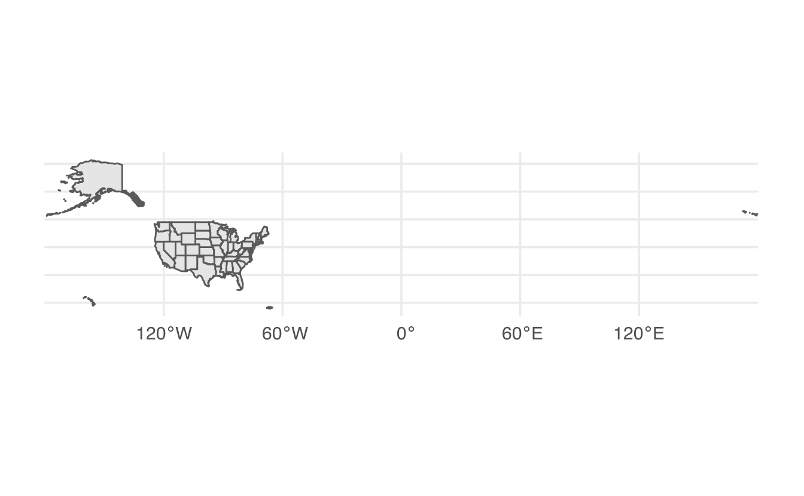

Because simple features data frames are standardized with the `geometry` column always containing information on the geographic coordinates of the features, we do not need to specify additional parameters for `aes()`. Notice a problem with the map above: it wastes a lot of space. This is caused by the presence of Alaska and Hawaii in the dataset. The Aleutian Islands cross the the 180th meridian, requiring the map to show the Eastern hemisphere. Likewise, Hawaii is substantially distant from the continental United States.

#### Plot a subset of a map

One solution is to plot just the lower 48 states. That is, exclude Alaska and Hawaii, as well as DC and Puerto Rico.^[Issues of political sovereignty aside, these entities are frequently excluded from maps depending on the data to be incorporated. You can always choose to leave them in the map.] Because simple features data frames contain one row per feature and in this example a feature is defined as a state, we can use `filter()` from `dplyr` to exclude these four states/territories.


```r
(usa_48 <- usa %>%
  filter(!(NAME %in% c("Alaska", "District of Columbia", "Hawaii", "Puerto Rico"))))
## Simple feature collection with 48 features and 9 fields
## Geometry type: MULTIPOLYGON
## Dimension:     XY
## Bounding box:  xmin: -125 ymin: 24.5 xmax: -66.9 ymax: 49.4
## Geodetic CRS:  NAD83
## First 10 features:
##    STATEFP  STATENS    AFFGEOID GEOID STUSPS        NAME LSAD    ALAND   AWATER
## 1       01 01779775 0400000US01    01     AL     Alabama   00 1.31e+11 4.59e+09
## 2       05 00068085 0400000US05    05     AR    Arkansas   00 1.35e+11 2.96e+09
## 3       06 01779778 0400000US06    06     CA  California   00 4.03e+11 2.05e+10
## 4       09 01779780 0400000US09    09     CT Connecticut   00 1.25e+10 1.82e+09
## 5       12 00294478 0400000US12    12     FL     Florida   00 1.39e+11 3.14e+10
## 6       13 01705317 0400000US13    13     GA     Georgia   00 1.49e+11 4.95e+09
## 7       16 01779783 0400000US16    16     ID       Idaho   00 2.14e+11 2.40e+09
## 8       17 01779784 0400000US17    17     IL    Illinois   00 1.44e+11 6.20e+09
## 9       18 00448508 0400000US18    18     IN     Indiana   00 9.28e+10 1.54e+09
## 10      20 00481813 0400000US20    20     KS      Kansas   00 2.12e+11 1.35e+09
##                          geometry
## 1  MULTIPOLYGON (((-88.3 30.2,...
## 2  MULTIPOLYGON (((-94.6 36.5,...
## 3  MULTIPOLYGON (((-119 33.5, ...
## 4  MULTIPOLYGON (((-73.7 41.1,...
## 5  MULTIPOLYGON (((-80.7 24.9,...
## 6  MULTIPOLYGON (((-85.6 35, -...
## 7  MULTIPOLYGON (((-117 44.4, ...
## 8  MULTIPOLYGON (((-91.5 40.2,...
## 9  MULTIPOLYGON (((-88.1 37.9,...
## 10 MULTIPOLYGON (((-102 40, -1...

ggplot(data = usa_48) +
  geom_sf()
```

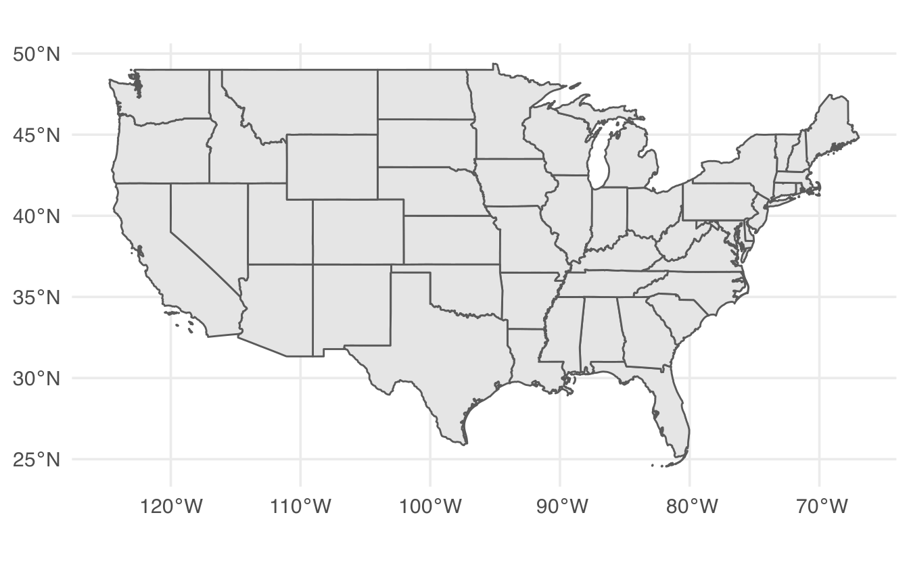

Since the map is a `ggplot()` object, it can easily be modified like any other `ggplot()` graph. We could change the color of the map and the borders:


```r
ggplot(data = usa_48) +
  geom_sf(fill = "palegreen", color = "black")
```

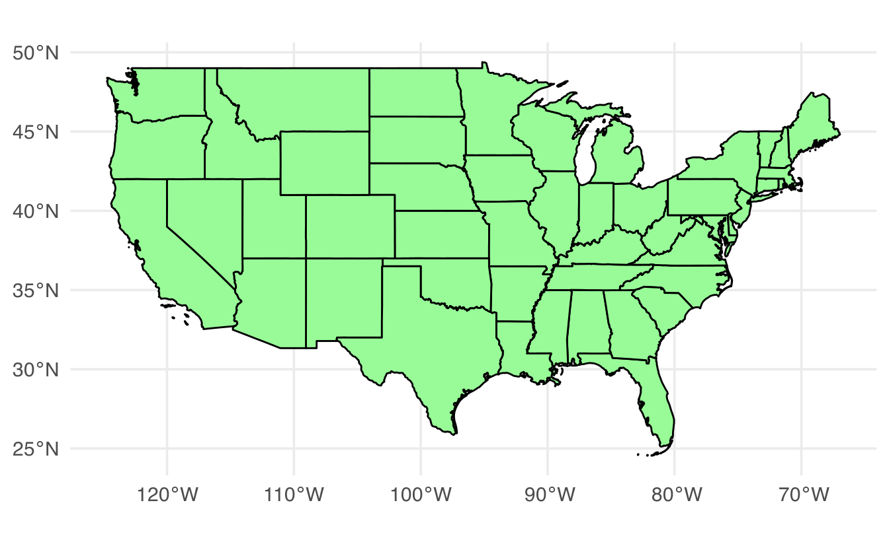

#### `albersusa`

Rather than excluding them entirely, most maps of the United States place Alaska and Hawaii as **insets** to the south of California. Until recently, in R this was an extremely tedious task that required manually changing the latitude and longitude coordinates for these states to place them in the correct location. Fortunately several packages are now available that have already done the work for you. [`albersusa`](https://github.com/hrbrmstr/albersusa) includes the `usa_sf()` function which returns a simple features data frame which contains adjusted coordinates for Alaska and Hawaii to plot them with the mainland. It can be installed from GitHub using `devtools::install_github("hrbrmstr/albersusa")`.


```r
library(albersusa)
usa_sf()
## Simple feature collection with 51 features and 13 fields
## Geometry type: MULTIPOLYGON
## Dimension:     XY
## Bounding box:  xmin: -125 ymin: 20.6 xmax: -66.9 ymax: 49.4
## Geodetic CRS:  WGS 84
## First 10 features:
##         geo_id fips_state                 name lsad census_area iso_3166_2
## 1  0400000US04         04              Arizona           113594         AZ
## 2  0400000US05         05             Arkansas            52035         AR
## 3  0400000US06         06           California           155779         CA
## 4  0400000US08         08             Colorado           103642         CO
## 5  0400000US09         09          Connecticut             4842         CT
## 6  0400000US11         11 District of Columbia               61         DC
## 7  0400000US13         13              Georgia            57513         GA
## 8  0400000US17         17             Illinois            55519         IL
## 9  0400000US18         18              Indiana            35826         IN
## 10 0400000US22         22            Louisiana            43204         LA
##      census pop_estimataes_base pop_2010 pop_2011 pop_2012 pop_2013 pop_2014
## 1   6392017             6392310  6411999  6472867  6556236  6634997  6731484
## 2   2915918             2915958  2922297  2938430  2949300  2958765  2966369
## 3  37253956            37254503 37336011 37701901 38062780 38431393 38802500
## 4   5029196             5029324  5048575  5119661  5191709  5272086  5355866
## 5   3574097             3574096  3579345  3590537  3594362  3599341  3596677
## 6    601723              601767   605210   620427   635040   649111   658893
## 7   9687653             9688681  9714464  9813201  9919000  9994759 10097343
## 8  12830632            12831587 12840097 12858725 12873763 12890552 12880580
## 9   6483802             6484192  6490308  6516560  6537632  6570713  6596855
## 10  4533372             4533479  4545581  4575972  4604744  4629284  4649676
##                          geometry
## 1  MULTIPOLYGON (((-113 37, -1...
## 2  MULTIPOLYGON (((-94 33, -94...
## 3  MULTIPOLYGON (((-120 34, -1...
## 4  MULTIPOLYGON (((-107 41, -1...
## 5  MULTIPOLYGON (((-72.4 42, -...
## 6  MULTIPOLYGON (((-77 38.8, -...
## 7  MULTIPOLYGON (((-84.8 35, -...
## 8  MULTIPOLYGON (((-89.4 42.5,...
## 9  MULTIPOLYGON (((-84.8 40.4,...
## 10 MULTIPOLYGON (((-88.9 29.8,...

ggplot(data = usa_sf()) +
  geom_sf()
```

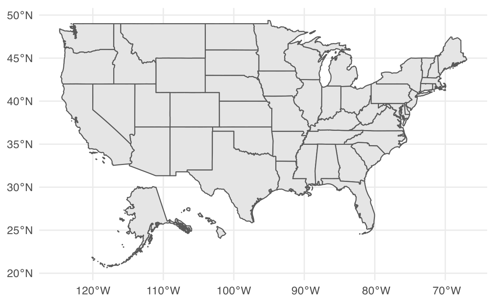

### Add data to the map

Region boundaries serve as the background in geospatial data visualization - so now we need to add data. Some types of geographic data (points and symbols) are overlaid on top of the boundaries, whereas other data (fill) are incorporated into the region layer itself.

#### Points

Let's use our `usa_48` map data to add some points. The `airports` data frame in the `nycflights13` package includes geographic info on airports in the United States.


```r
library(nycflights13)
airports
## # A tibble: 1,458 × 8
##    faa   name                             lat    lon   alt    tz dst   tzone    
##    <chr> <chr>                          <dbl>  <dbl> <dbl> <dbl> <chr> <chr>    
##  1 04G   Lansdowne Airport               41.1  -80.6  1044    -5 A     America/…
##  2 06A   Moton Field Municipal Airport   32.5  -85.7   264    -6 A     America/…
##  3 06C   Schaumburg Regional             42.0  -88.1   801    -6 A     America/…
##  4 06N   Randall Airport                 41.4  -74.4   523    -5 A     America/…
##  5 09J   Jekyll Island Airport           31.1  -81.4    11    -5 A     America/…
##  6 0A9   Elizabethton Municipal Airport  36.4  -82.2  1593    -5 A     America/…
##  7 0G6   Williams County Airport         41.5  -84.5   730    -5 A     America/…
##  8 0G7   Finger Lakes Regional Airport   42.9  -76.8   492    -5 A     America/…
##  9 0P2   Shoestring Aviation Airfield    39.8  -76.6  1000    -5 U     America/…
## 10 0S9   Jefferson County Intl           48.1 -123.    108    -8 A     America/…
## # … with 1,448 more rows
```

Each airport has it's geographic location encoded through `lat` and `lon`. To draw these points on the map, basically we draw a scatterplot with `x = lon` and `y = lat`. In fact we could simply do that:


```r
ggplot(airports, aes(lon, lat)) +
  geom_point()
```

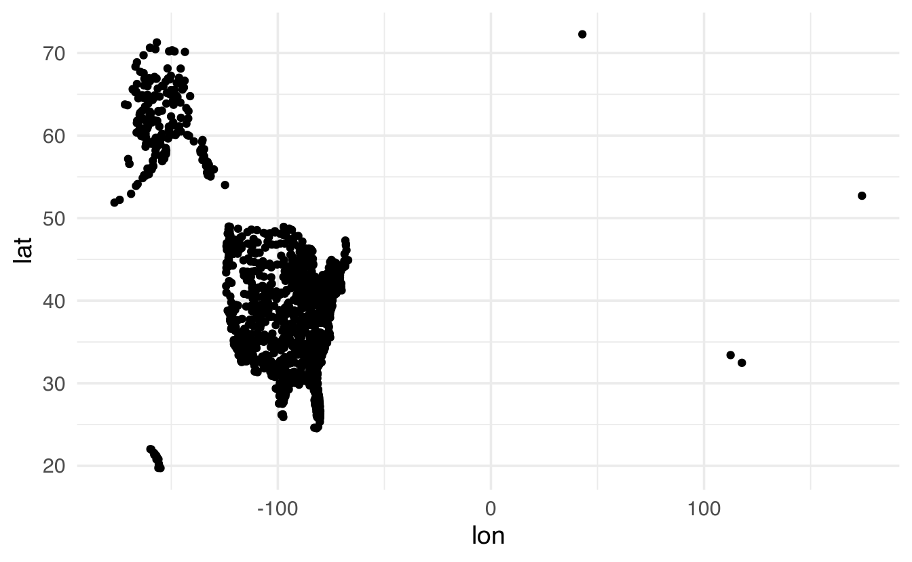

Let's overlay it with the mapped state borders:


```r
ggplot(data = usa_48) + 
  geom_sf() + 
  geom_point(data = airports, aes(x = lon, y = lat), shape = 1)
```

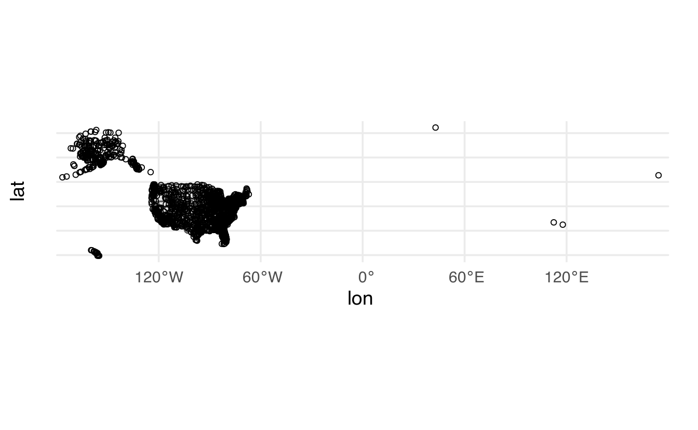

Slight problem. We have airports listed outside of the continental United States. There are a couple ways to rectify this. Unfortunately `airports` does not include a variable identifying state so the `filter()` operation is not that simple. The easiest solution is to crop the limits of the graph using `coord_sf()` to only show the mainland:


```r
ggplot(data = usa_48) + 
  geom_sf() + 
  geom_point(data = airports, aes(x = lon, y = lat), shape = 1) +
  coord_sf(xlim = c(-130, -60),
           ylim = c(20, 50))
```

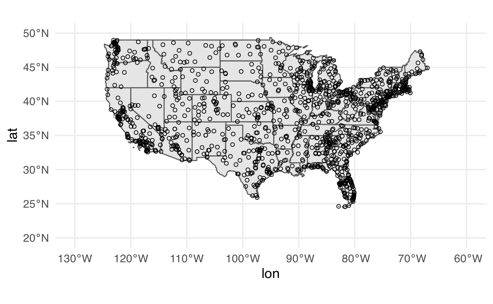

Alternatively, we can use `st_as_sf()` to convert `airports` to a simple features data frame.


```r
airports_sf <- st_as_sf(airports, coords = c("lon", "lat"))
st_crs(airports_sf) <- 4326   # set the coordinate reference system
airports_sf
## Simple feature collection with 1458 features and 6 fields
## Geometry type: POINT
## Dimension:     XY
## Bounding box:  xmin: -177 ymin: 19.7 xmax: 174 ymax: 72.3
## Geodetic CRS:  WGS 84
## # A tibble: 1,458 × 7
##    faa   name                    alt    tz dst   tzone     geometry
##  * <chr> <chr>                 <dbl> <dbl> <chr> <chr>  <POINT [°]>
##  1 04G   Lansdowne Airport      1044    -5 A     Amer… (-80.6 41.1)
##  2 06A   Moton Field Municipa…   264    -6 A     Amer… (-85.7 32.5)
##  3 06C   Schaumburg Regional     801    -6 A     Amer…   (-88.1 42)
##  4 06N   Randall Airport         523    -5 A     Amer… (-74.4 41.4)
##  5 09J   Jekyll Island Airport    11    -5 A     Amer… (-81.4 31.1)
##  6 0A9   Elizabethton Municip…  1593    -5 A     Amer… (-82.2 36.4)
##  7 0G6   Williams County Airp…   730    -5 A     Amer… (-84.5 41.5)
##  8 0G7   Finger Lakes Regiona…   492    -5 A     Amer… (-76.8 42.9)
##  9 0P2   Shoestring Aviation …  1000    -5 U     Amer… (-76.6 39.8)
## 10 0S9   Jefferson County Intl   108    -8 A     Amer…  (-123 48.1)
## # … with 1,448 more rows
```

`coords` tells `st_as_sf()` which columns contain the geographic coordinates of each airport. To graph the points on the map, we use a second `geom_sf()`:


```r
ggplot() + 
  geom_sf(data = usa_48) + 
  geom_sf(data = airports_sf, shape = 1) +
  coord_sf(xlim = c(-130, -60),
           ylim = c(20, 50))
```

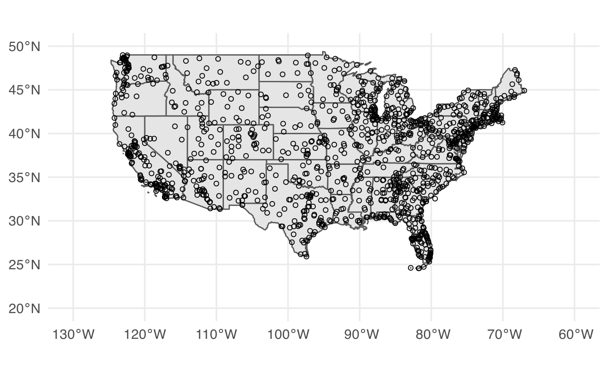

#### Symbols

We can change the size or type of symbols on the map. For instance, we can draw a **bubble plot** (also known as a **proportional symbol map**) and encode the altitude of the airport through the size channel:


```r
ggplot(data = usa_48) + 
  geom_sf() + 
  geom_point(data = airports, aes(x = lon, y = lat, size = alt),
             fill = "grey", color = "black", alpha = .2) +
  coord_sf(xlim = c(-130, -60),
           ylim = c(20, 50)) +
  scale_size_area(guide = FALSE)
```

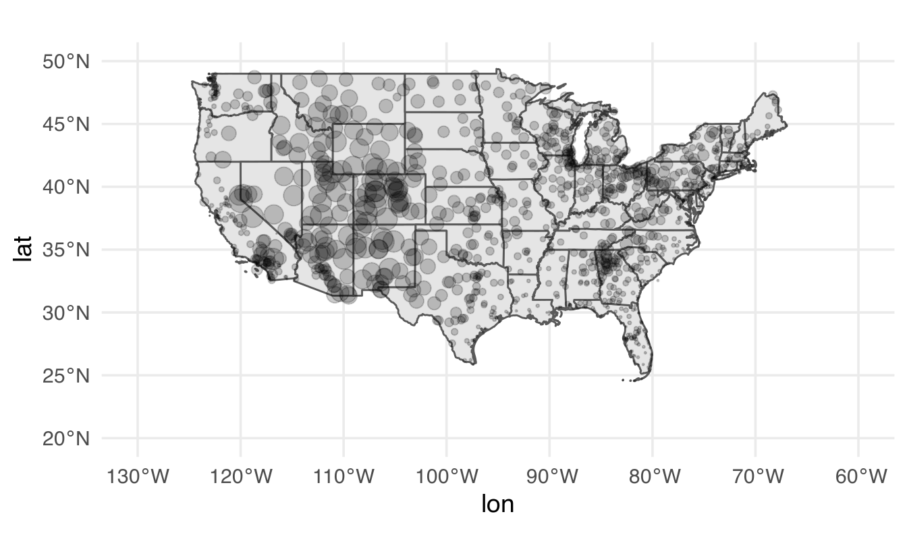

Circle area is proportional to the airport's altitude (in feet). Or we could scale it based on the number of arriving flights in `flights`:


```r
airports_n <- flights %>%
  count(dest) %>%
  left_join(airports, by = c("dest" = "faa"))

ggplot(data = usa_48) + 
  geom_sf() + 
  geom_point(data = airports_n, aes(x = lon, y = lat, size = n),
             fill = "grey", color = "black", alpha = .2) +
  coord_sf(xlim = c(-130, -60),
           ylim = c(20, 50)) +
  scale_size_area(guide = FALSE)
```

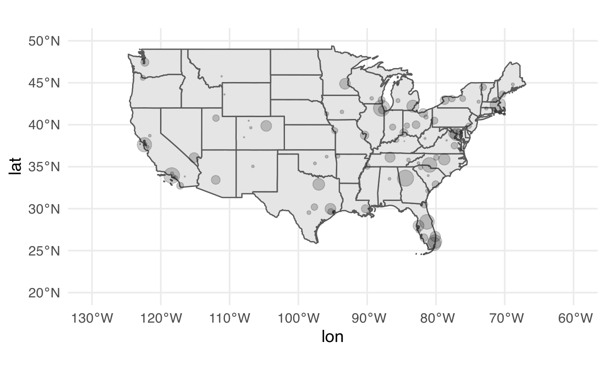

\BeginKnitrBlock{rmdnote}<div class="rmdnote">`airports` contains a list of virtually all commercial airports in the United States. However `flights` only contains data on flights departing from New York City airports (JFK, LaGuardia, or Newark) and only services a few airports around the country.
</div>\EndKnitrBlock{rmdnote}

#### Fill (choropleths)

**Choropleth maps** encode information by assigning shades of colors to defined areas on a map (e.g. countries, states, counties, zip codes). There are lots of ways to tweak and customize these graphs, which is generally a good idea because remember that color is one of the harder-to-decode channels.

We will continue to use the `usa_48` simple features data frame and draw a choropleth for the number of foreign-born individuals in each state. We get those files from the `census_bureau` folder. Let's also normalize our measure by the total population to get the rate of foreign-born individuals in the population:


```r
(fb_state <- here("data", "census_bureau",
                  "ACS_13_5YR_B05012_state", "ACS_13_5YR_B05012.csv") %>%
   read_csv() %>%
  mutate(rate = HD01_VD03 / HD01_VD01))
## # A tibble: 51 × 10
##    GEO.id      GEO.id2 `GEO.display-la…` HD01_VD01 HD02_VD01 HD01_VD02 HD02_VD02
##    <chr>       <chr>   <chr>                 <dbl> <lgl>         <dbl>     <dbl>
##  1 0400000US01 01      Alabama             4799277 NA          4631045      2881
##  2 0400000US02 02      Alaska               720316 NA           669941      1262
##  3 0400000US04 04      Arizona             6479703 NA          5609835      7725
##  4 0400000US05 05      Arkansas            2933369 NA          2799972      2568
##  5 0400000US06 06      California         37659181 NA         27483342     30666
##  6 0400000US08 08      Colorado            5119329 NA          4623809      5778
##  7 0400000US09 09      Connecticut         3583561 NA          3096374      5553
##  8 0400000US10 10      Delaware             908446 NA           831683      2039
##  9 0400000US11 11      District of Colu…    619371 NA           534142      2017
## 10 0400000US12 12      Florida            19091156 NA         15392410     16848
## # … with 41 more rows, and 3 more variables: HD01_VD03 <dbl>, HD02_VD03 <dbl>,
## #   rate <dbl>
```

##### Join the data

Now that we have our data, we want to draw it on the map. `fb_state` contains one row per state, as does `usa_48`. Since there is a one-to-one match between the data frames, we join the data frames together first, then use that single data frame to draw the map. This differs from the approach above for drawing points because a point feature is not the same thing as a polygon feature. That is, there were more airports then there were states. Because the spatial data is stored in a data frame with one row per state, all we need to do is merge the data frames together on a column that uniquely identifies each row in each data frame.


```r
(usa_fb <- usa_48 %>%
  left_join(fb_state, by = c("STATEFP" = "GEO.id2")))
## Simple feature collection with 48 features and 18 fields
## Geometry type: MULTIPOLYGON
## Dimension:     XY
## Bounding box:  xmin: -125 ymin: 24.5 xmax: -66.9 ymax: 49.4
## Geodetic CRS:  NAD83
## First 10 features:
##    STATEFP  STATENS    AFFGEOID GEOID STUSPS        NAME LSAD    ALAND   AWATER
## 1       01 01779775 0400000US01    01     AL     Alabama   00 1.31e+11 4.59e+09
## 2       05 00068085 0400000US05    05     AR    Arkansas   00 1.35e+11 2.96e+09
## 3       06 01779778 0400000US06    06     CA  California   00 4.03e+11 2.05e+10
## 4       09 01779780 0400000US09    09     CT Connecticut   00 1.25e+10 1.82e+09
## 5       12 00294478 0400000US12    12     FL     Florida   00 1.39e+11 3.14e+10
## 6       13 01705317 0400000US13    13     GA     Georgia   00 1.49e+11 4.95e+09
## 7       16 01779783 0400000US16    16     ID       Idaho   00 2.14e+11 2.40e+09
## 8       17 01779784 0400000US17    17     IL    Illinois   00 1.44e+11 6.20e+09
## 9       18 00448508 0400000US18    18     IN     Indiana   00 9.28e+10 1.54e+09
## 10      20 00481813 0400000US20    20     KS      Kansas   00 2.12e+11 1.35e+09
##         GEO.id GEO.display-label HD01_VD01 HD02_VD01 HD01_VD02 HD02_VD02
## 1  0400000US01           Alabama   4799277        NA   4631045      2881
## 2  0400000US05          Arkansas   2933369        NA   2799972      2568
## 3  0400000US06        California  37659181        NA  27483342     30666
## 4  0400000US09       Connecticut   3583561        NA   3096374      5553
## 5  0400000US12           Florida  19091156        NA  15392410     16848
## 6  0400000US13           Georgia   9810417        NA   8859747      7988
## 7  0400000US16             Idaho   1583364        NA   1489560      2528
## 8  0400000US17          Illinois  12848554        NA  11073828     10091
## 9  0400000US18           Indiana   6514861        NA   6206801      4499
## 10 0400000US20            Kansas   2868107        NA   2677007      3095
##    HD01_VD03 HD02_VD03   rate                       geometry
## 1     168232      2881 0.0351 MULTIPOLYGON (((-88.3 30.2,...
## 2     133397      2568 0.0455 MULTIPOLYGON (((-94.6 36.5,...
## 3   10175839     30666 0.2702 MULTIPOLYGON (((-119 33.5, ...
## 4     487187      5553 0.1360 MULTIPOLYGON (((-73.7 41.1,...
## 5    3698746     16848 0.1937 MULTIPOLYGON (((-80.7 24.9,...
## 6     950670      7988 0.0969 MULTIPOLYGON (((-85.6 35, -...
## 7      93804      2528 0.0592 MULTIPOLYGON (((-117 44.4, ...
## 8    1774726     10093 0.1381 MULTIPOLYGON (((-91.5 40.2,...
## 9     308060      4500 0.0473 MULTIPOLYGON (((-88.1 37.9,...
## 10    191100      3100 0.0666 MULTIPOLYGON (((-102 40, -1...
```

##### Draw the map

With the newly combined data frame, use `geom_sf()` and define the `fill` aesthetic based on the column in `usa_fb` you want to visualize.


```r
ggplot(data = usa_fb) +
  geom_sf(aes(fill = rate))
```

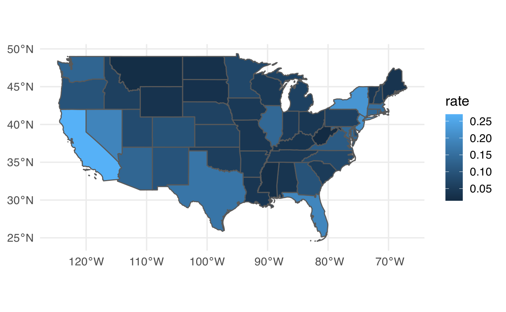

#### Bin data to discrete intervals

When creating a heatmap with a continuous variable, one must decide whether to keep the variable as continuous or collapse it into a series of bins with discrete colors. While keep the variable continuous is technically more precise, [the human eye cannot usually distinguish between two colors which are very similar to one another.](https://www.perceptualedge.com/articles/visual_business_intelligence/heatmaps_to_bin_or_not.pdf) By converting the variable to a discrete variable, you easily distinguish between the different levels. If you decide to convert a continuous variable to a discrete variable, you will need to decide how to do this. While `cut()` is a base R function for converting continuous variables into discrete values, `ggplot2` offers two functions that explicitly define how we want to bin the numeric vector (column).

`cut_interval()` makes `n` groups with equal range:


```r
usa_fb %>%
  mutate(rate_cut = cut_interval(rate, n = 6)) %>%
  ggplot() +
  geom_sf(aes(fill = rate_cut))
```

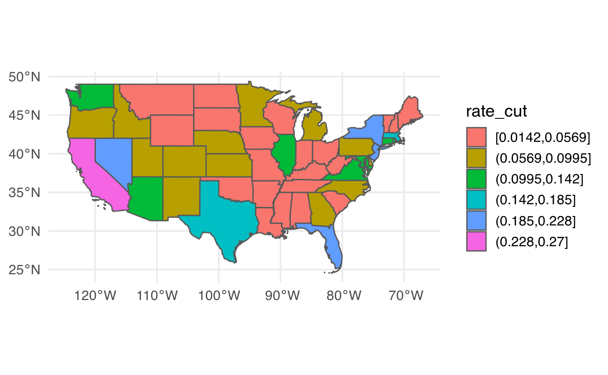

Whereas `cut_number()` makes `n` groups with (approximately) equal numbers of observations:


```r
usa_fb %>%
  mutate(rate_cut = cut_number(rate, n = 6)) %>%
  ggplot() +
  geom_sf(aes(fill = rate_cut))
```

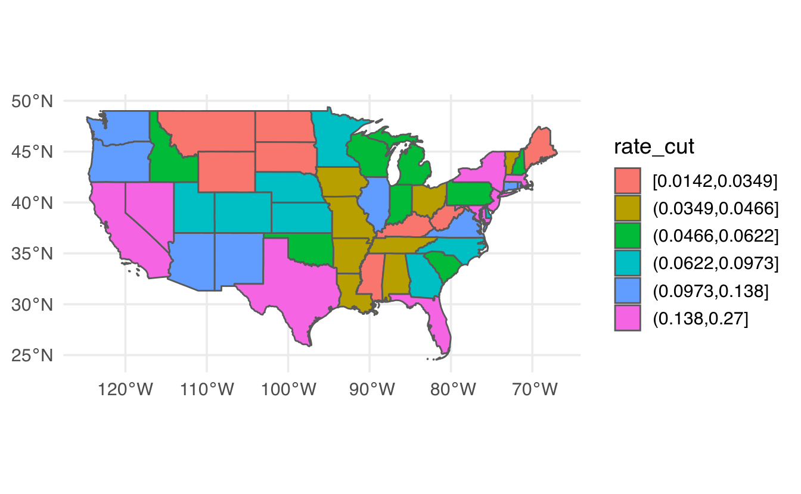

\BeginKnitrBlock{rmdnote}<div class="rmdnote">See [this StackOverflow thread](https://gis.stackexchange.com/questions/86668/should-i-use-a-discrete-or-continuous-scale-for-coloring-a-chloropleth) for a more in-depth discussion on the merits of bucketizing a continuous variable and whether to use `cut_interval()` or `cut_number()`.
</div>\EndKnitrBlock{rmdnote}

### Changing map projection

<iframe src="https://www.youtube.com/embed/vVX-PrBRtTY" width="80%" height="400px" data-external="1"></iframe>

<div class="figure" style="text-align: center">

<p class="caption">(\#fig:xkcd-mercator)[Mercator Projection](https://xkcd.com/2082/)</p>
</div>

Representing portions of the globe on a flat surface can be challenging. Depending on how you project the map, you can distort or emphasize certain features of the map. Fortunately, `ggplot()` includes the `coord_sf()` function which allows us to easily implement different projection methods. In order to implement coordinate transformations, you need to know the **coordinate reference system** that defines the projection method. The "easiest" approach is to provide what is known as the `proj4string` that defines the projection method. [PROJ4](https://proj4.org/) is a generic coordinate transformation software that allows you to convert between projection methods. If you get really into geospatial analysis and visualization, it is helpful to learn this system.

For our purposes here, `proj4string` is a character string in R that defines the coordinate system and includes parameters specific to a given coordinate transformation. PROJ4 includes [some documentation on common projection methods](https://proj4.org/operations/projections/index.html) that can get you started. Some projection methods are relatively simple and require just the name of the projection, like for a [Mercator projection](https://proj4.org/operations/projections/merc.html) (`"+proj=merc"`):


```r
map_proj_base <- ggplot(data = usa_48) +
  geom_sf()
```


```r
map_proj_base +
  coord_sf(crs = "+proj=merc") +
  ggtitle("Mercator projection")
```

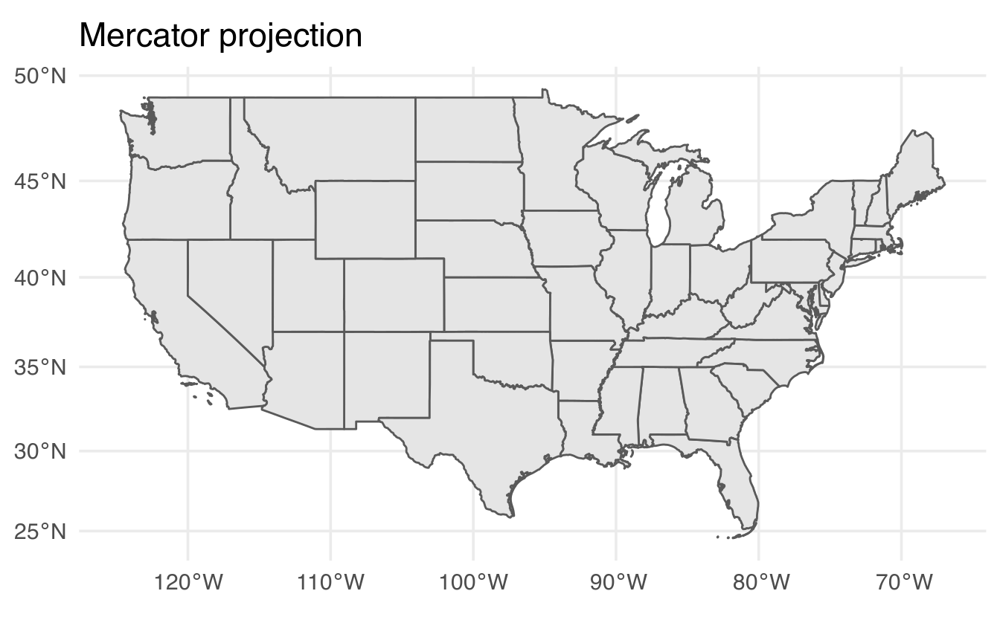

Other coordinate systems require specification of the **standard lines**, or lines that define areas of the surface of the map that are tangent to the globe. These include [Gall-Peters](http://spatialreference.org/ref/sr-org/gall-peters-orthographic-projection/proj4/), [Albers equal-area](https://proj4.org/operations/projections/aea.html), and [Lambert azimuthal](https://proj4.org/operations/projections/laea.html).


```r
map_proj_base +
  coord_sf(crs = "+proj=cea +lon_0=0 +lat_ts=45") +
  ggtitle("Gall-Peters projection")
```

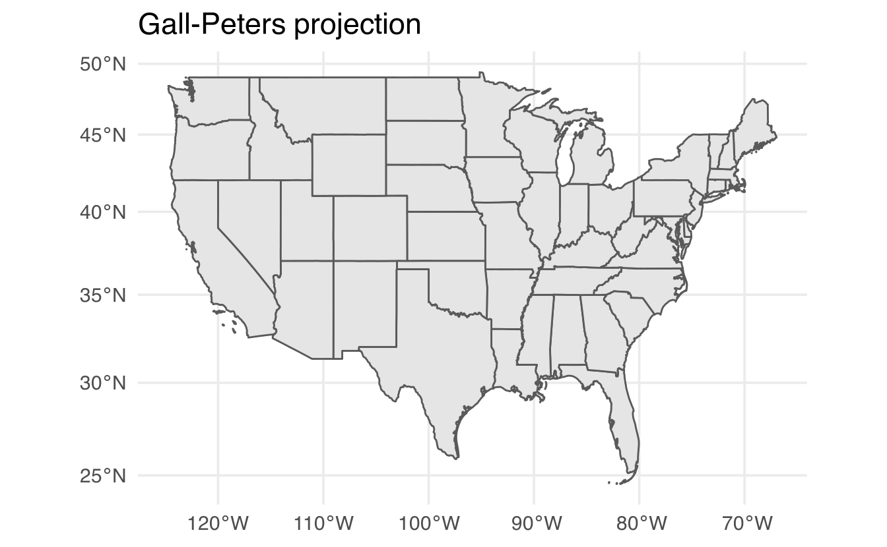

```r

map_proj_base +
  coord_sf(crs = "+proj=aea +lat_1=25 +lat_2=50 +lon_0=-100") +
  ggtitle("Albers equal-area projection")
```

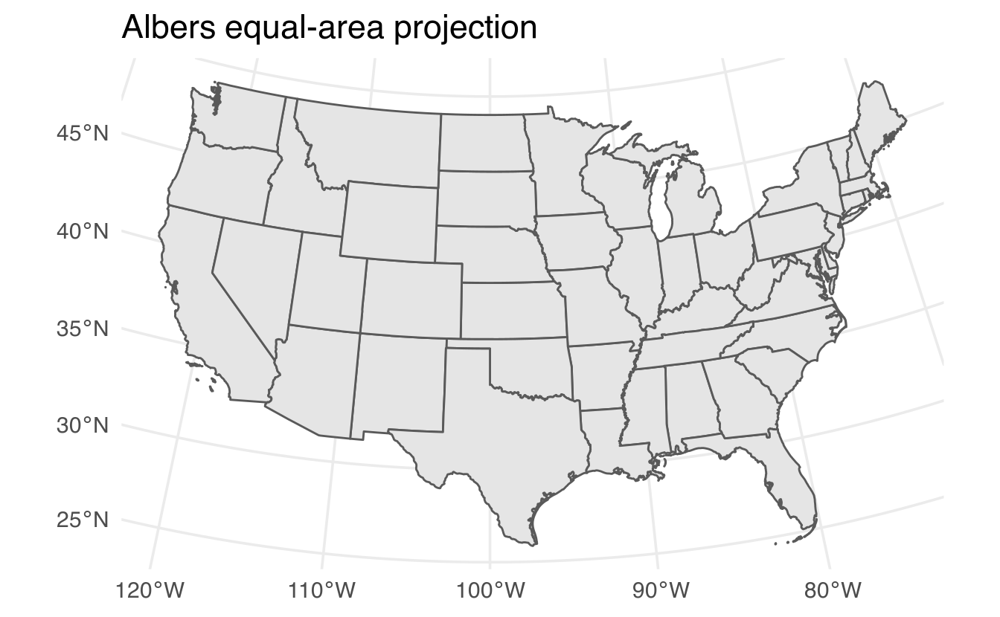

```r

map_proj_base +
  coord_sf(crs = "+proj=laea +lat_0=35 +lon_0=-100") +
  ggtitle("Lambert azimuthal projection")
```

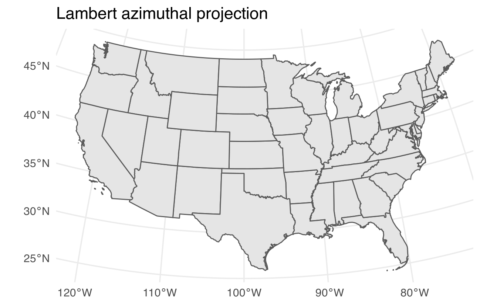

## Practice drawing vector maps

### American Community Survey

The U.S. Census Bureau conducts the [American Community Survey](https://www.census.gov/programs-surveys/acs) which gathers detailed information on topics such as demographics, employment, educational attainment, etc. They make a vast portion of their data available through an [application programming interface (API)](/notes/application-program-interface/), which can be accessed intuitively through R via the [`tidycensus` package](https://walkerke.github.io/tidycensus/index.html). We previously discussed how to use this package to [obtain statistical data from the decennial census](/notes/application-program-interface/#census-data-with-tidycensus). However the Census Bureau also has detailed information on political and geographic boundaries which we can combine with their statistical measures to easily construct geospatial visualizations.

\BeginKnitrBlock{rmdalert}<div class="rmdalert">If you have not already, [obtain an API key](https://api.census.gov/data/key_signup.html) and [store it securely](/notes/application-program-interface/#census-data-with-tidycensus) on your computer.
</div>\EndKnitrBlock{rmdalert}

### Exercise: Visualize income data

1. Obtain information on median household income in 2017 for Cook County, IL at the tract-level using the ACS. To retrieve the geographic features for each tract, set `geometry = TRUE` in your function.

    > You can use `load_variables(year = 2017, dataset = "acs5")` to retrieve the list of variables available and search to find the correct variable name.

    <details> 
      <summary>Click for the solution</summary>
      <p>
    
    
    ```r
    cook_inc <- get_acs(state = "IL",
                        county = "Cook",
                        geography = "tract", 
                        variables = c(medincome = "B19013_001"), 
                        year = 2017,
                        geometry = TRUE)
    ```
    
    
    ```r
    cook_inc
    ## Simple feature collection with 1319 features and 5 fields (with 1 geometry empty)
    ## Geometry type: MULTIPOLYGON
    ## Dimension:     XY
    ## Bounding box:  xmin: -88.3 ymin: 41.5 xmax: -87.5 ymax: 42.2
    ## Geodetic CRS:  NAD83
    ## First 10 features:
    ##          GEOID                                       NAME  variable estimate
    ## 1  17031010201 Census Tract 102.01, Cook County, Illinois medincome    40841
    ## 2  17031030200    Census Tract 302, Cook County, Illinois medincome    64089
    ## 3  17031031700    Census Tract 317, Cook County, Illinois medincome    44555
    ## 4  17031031900    Census Tract 319, Cook County, Illinois medincome    61211
    ## 5  17031050200    Census Tract 502, Cook County, Illinois medincome    74375
    ## 6  17031051300    Census Tract 513, Cook County, Illinois medincome   149271
    ## 7  17031061500    Census Tract 615, Cook County, Illinois medincome   117656
    ## 8  17031062600    Census Tract 626, Cook County, Illinois medincome   144211
    ## 9  17031063400    Census Tract 634, Cook County, Illinois medincome    95488
    ## 10 17031070600    Census Tract 706, Cook County, Illinois medincome   151250
    ##      moe                       geometry
    ## 1   7069 MULTIPOLYGON (((-87.7 42, -...
    ## 2  12931 MULTIPOLYGON (((-87.7 42, -...
    ## 3  12220 MULTIPOLYGON (((-87.7 42, -...
    ## 4   6343 MULTIPOLYGON (((-87.7 42, -...
    ## 5  18773 MULTIPOLYGON (((-87.7 42, -...
    ## 6  26389 MULTIPOLYGON (((-87.7 41.9,...
    ## 7  11416 MULTIPOLYGON (((-87.7 41.9,...
    ## 8  22537 MULTIPOLYGON (((-87.7 41.9,...
    ## 9   4904 MULTIPOLYGON (((-87.6 41.9,...
    ## 10 47800 MULTIPOLYGON (((-87.7 41.9,...
    ```
        
      </p>
    </details>

1. Draw a choropleth using the median household income data. Use a continuous color gradient to identify each tract's median household income.

    <details> 
      <summary>Click for the solution</summary>
      <p>
    
    
    ```r
    ggplot(data = cook_inc) +
      # use fill and color to avoid gray boundary lines
      geom_sf(aes(fill = estimate, color = estimate)) +
      # increase interpretability of graph
      scale_color_continuous(labels = scales::dollar) +
      scale_fill_continuous(labels = scales::dollar) +
      labs(title = "Median household income in Cook County, IL",
           subtitle = "In 2017",
           color = NULL,
           fill = NULL,
           caption = "Source: American Community Survey")
    ```
    
    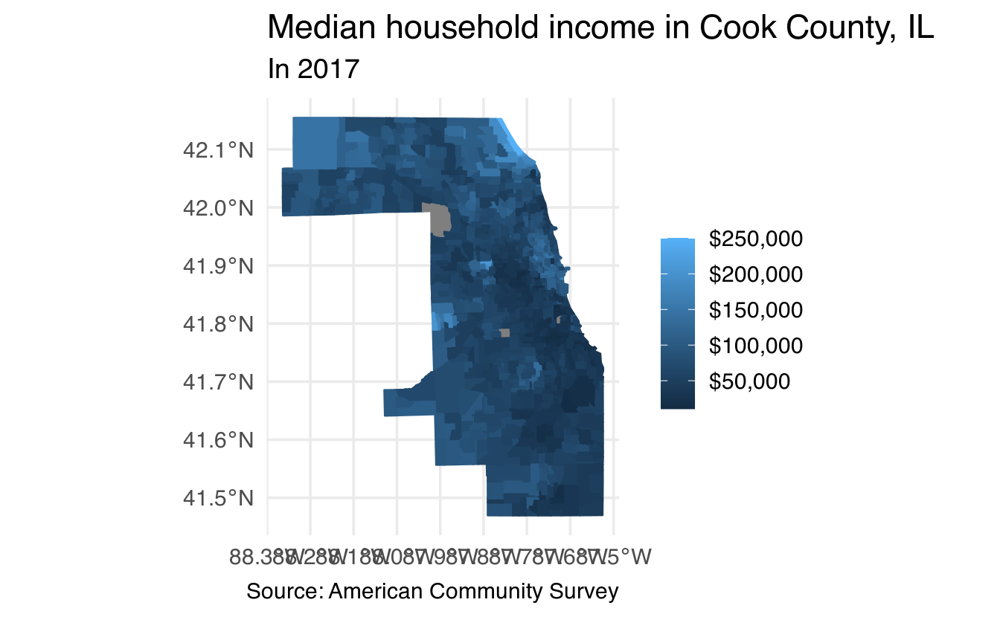
        
      </p>
    </details>

### Exercise: Customize your maps

1. Draw the same choropleth for Cook County, but convert median household income into a discrete variable with 6 levels.

    <details> 
      <summary>Click for the solution</summary>
      <p>
    
    * Using `cut_interval()`:
    
        
        ```r
        cook_inc %>%
          mutate(inc_cut = cut_interval(estimate, n = 6)) %>%
          ggplot() +
          # use fill and color to avoid gray boundary lines
          geom_sf(aes(fill = inc_cut, color = inc_cut)) +
          # increase interpretability of graph
          labs(title = "Median household income in Cook County, IL",
               subtitle = "In 2017",
               color = NULL,
               fill = NULL,
               caption = "Source: American Community Survey")
        ```
        
        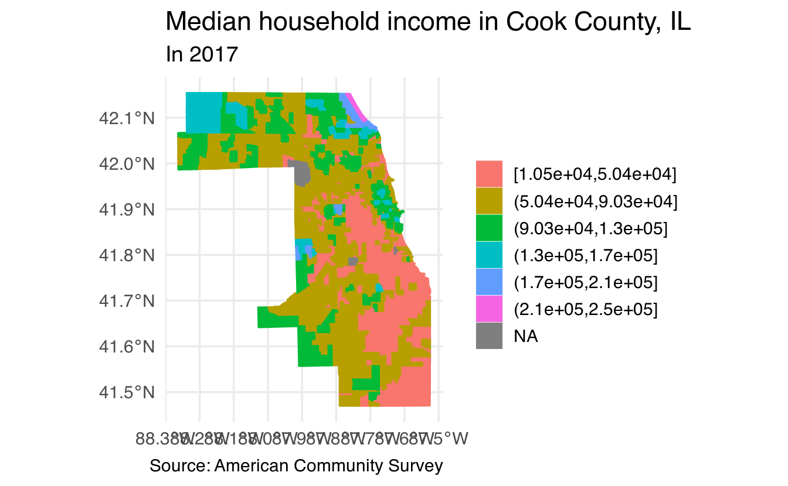
            
    * Using `cut_number()`:
    
        
        ```r
        cook_inc %>%
          mutate(inc_cut = cut_number(estimate, n = 6)) %>%
          ggplot() +
          # use fill and color to avoid gray boundary lines
          geom_sf(aes(fill = inc_cut, color = inc_cut)) +
          # increase interpretability of graph
          labs(title = "Median household income in Cook County, IL",
               subtitle = "In 2017",
               color = NULL,
               fill = NULL,
               caption = "Source: American Community Survey")
        ```
        
        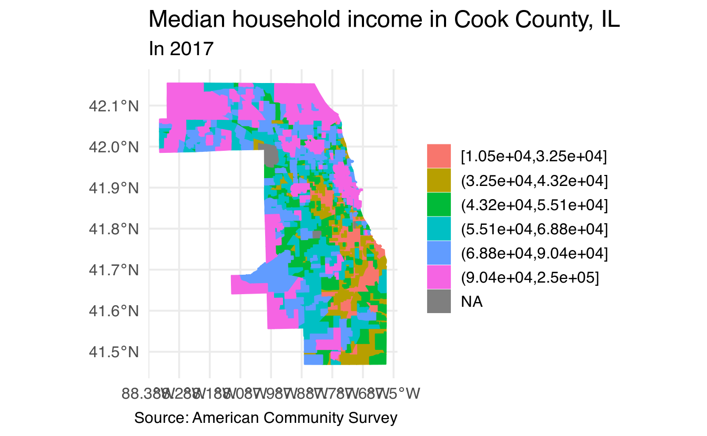
            
      </p>
    </details>

1. Draw the same choropleth for Cook County using the discrete variable, but select an appropriate color palette using [Color Brewer](/notes/optimal-color-palettes/#color-brewer).

    <details> 
      <summary>Click for the solution</summary>
      <p>
    
    * Using `cut_interval()` and the Blue-Green palette:
    
        
        ```r
        cook_inc %>%
          mutate(inc_cut = cut_interval(estimate, n = 6)) %>%
          ggplot() +
          # use fill and color to avoid gray boundary lines
          geom_sf(aes(fill = inc_cut, color = inc_cut)) +
          scale_fill_brewer(type = "seq", palette = "BuGn") +
          scale_color_brewer(type = "seq", palette = "BuGn") +
          # increase interpretability of graph
          labs(title = "Median household income in Cook County, IL",
               subtitle = "In 2017",
               color = NULL,
               fill = NULL,
               caption = "Source: American Community Survey")
        ```
        
        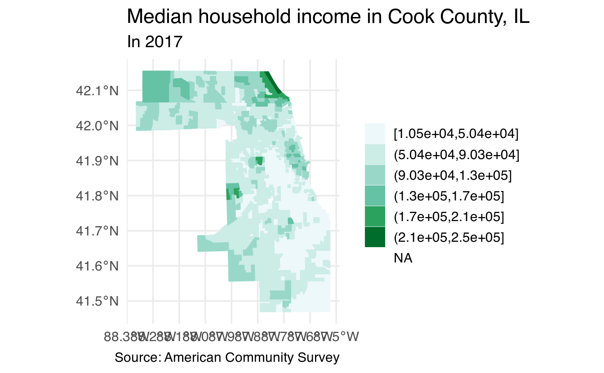
        
    * Using `cut_number()` and the Blue-Green palette:
    
        
        ```r
        cook_inc %>%
          mutate(inc_cut = cut_number(estimate, n = 6)) %>%
          ggplot() +
          # use fill and color to avoid gray boundary lines
          geom_sf(aes(fill = inc_cut, color = inc_cut)) +
          scale_fill_brewer(type = "seq", palette = "BuGn") +
          scale_color_brewer(type = "seq", palette = "BuGn") +
         # increase interpretability of graph
          labs(title = "Median household income in Cook County, IL",
               subtitle = "In 2017",
               color = NULL,
               fill = NULL,
               caption = "Source: American Community Survey")
        ```
        
        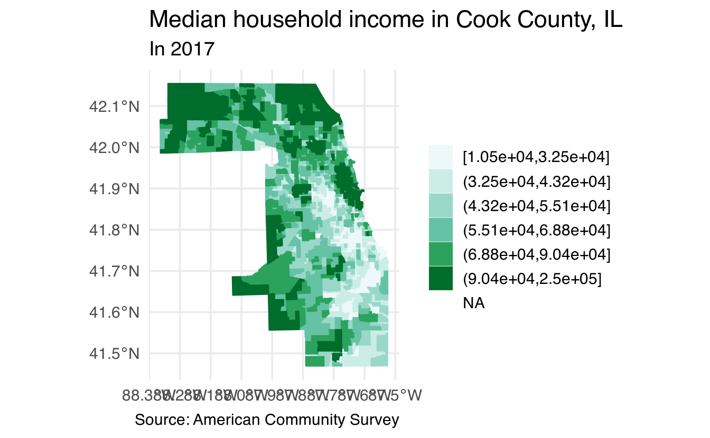
        
        
    You can choose any palette that is for sequential data.
    
      </p>
    </details>

1. Use the [`viridis` color palette](/notes/optimal-color-palettes/#viridis) for the Cook County map drawn using the continuous measure.

    <details> 
      <summary>Click for the solution</summary>
      <p>
    
    
    ```r
    ggplot(data = cook_inc) +
      # use fill and color to avoid gray boundary lines
      geom_sf(aes(fill = estimate, color = estimate)) +
      # increase interpretability of graph
      scale_color_viridis(labels = scales::dollar) +
      scale_fill_viridis(labels = scales::dollar) +
      labs(title = "Median household income in Cook County, IL",
           subtitle = "In 2017",
           color = NULL,
           fill = NULL,
           caption = "Source: American Community Survey")
    ```
    
    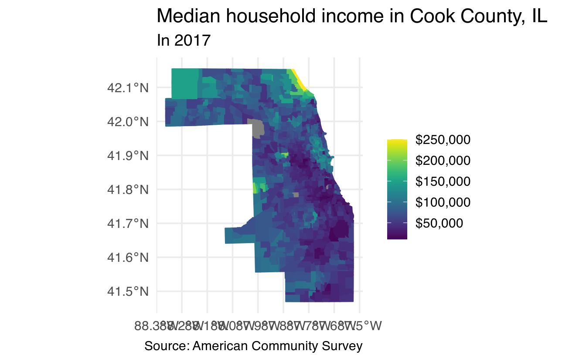
        
      </p>
    </details>
 
## Selecting optimal color palettes

Selection of your **color palette** is perhaps the most important decision to make when drawing a choropleth. By default, `ggplot2` picks evenly spaced hues around the [Hue-Chroma-Luminance (HCL) color space](https://en.wikipedia.org/wiki/HCL_color_space):^[Check out chapter 6.6.2 in *`ggplot2`: Elegant Graphics for Data Analysis* for a much more thorough explanation of the theory behind this selection process]


`ggplot2` gives you many different ways of defining and customizing your `scale_color_` and `scale_fill_` palettes, but will not tell you if they are optimal for your specific usage in the graph.

### Color Brewer


[Color Brewer](http://colorbrewer2.org/) is a diagnostic tool for selecting optimal color palettes for maps with discrete variables. The authors have generated different color palettes designed to make differentiating between categories easy depending on the scaling of your variable. All you need to do is define the number of categories in the variable, the nature of your data (sequential, diverging, or qualitative), and a color scheme. There are also options to select palettes that are colorblind safe, print friendly, and photocopy safe. Depending on the combination of options, you may not find any color palette that matches your criteria. In such a case, consider reducing the number of data classes.

#### Sequential

Sequential palettes work best with ordered data that progresses from a low to high value.


```r
display.brewer.all(type = "seq")
```


#### Diverging

Diverging palettes work for variables with meaningful mid-range values, as well as extreme low and high values.


```r
display.brewer.all(type = "div")
```


#### Qualitative

Qualitative palettes are best used for nominal data where there is no inherent ordering to the categories.


```r
display.brewer.all(type = "qual")
```


### Viridis

The [`viridis`](https://cran.r-project.org/web/packages/viridis/) package imports several color palettes for continuous variables from the `matplotlib` package in Python. These palettes have been tested to be colorful, perceptually uniform, robust to colorblindness, and pretty. To use these with `ggplot2`, use `scale_color_viridis()` and `scale_fill_viridis()`:


```r
library(viridis)

viridis_base <- ggplot(state_inc) +
  geom_sf(aes(fill = estimate)) +
  labs(title = "Median household income, 2016",
       subtitle = "Palette: viridis",
       caption = "Source: 2016 American Community Survey",
       fill = NULL) +
  scale_fill_viridis(labels = scales::dollar)

viridis_base
```


```r
viridis_base +
  scale_fill_viridis(option = "cividis", labels = scales::dollar) +
  labs(subtitle = "Palette: cividis")
```


```r
viridis_base +
  scale_fill_viridis(option = "inferno", labels = scales::dollar) +
  labs(subtitle = "Palette: inferno")
```


```r
viridis_base +
  scale_fill_viridis(option = "magma", labels = scales::dollar) +
  labs(subtitle = "Palette: magma")
```


```r
viridis_base +
  scale_fill_viridis(option = "plasma", labels = scales::dollar) +
  labs(subtitle = "Palette: plasma")
```


## Session info {-}


```r
devtools::session_info()
## ─ Session info ───────────────────────────────────────────────────────────────
##  setting  value
##  version  R version 4.1.2 (2021-11-01)
##  os       macOS Monterey 12.2.1
##  system   aarch64, darwin20
##  ui       X11
##  language (EN)
##  collate  en_US.UTF-8
##  ctype    en_US.UTF-8
##  tz       America/Chicago
##  date     2022-03-04
##  pandoc   2.17.1.1 @ /Applications/RStudio.app/Contents/MacOS/quarto/bin/ (via rmarkdown)
## 
## ─ Packages ───────────────────────────────────────────────────────────────────
##  package       * version    date (UTC) lib source
##  albersusa     * 0.4.1      2022-01-06 [1] Github (hrbrmstr/albersusa@07aa87f)
##  assertthat      0.2.1      2019-03-21 [1] CRAN (R 4.1.0)
##  backports       1.4.1      2021-12-13 [1] CRAN (R 4.1.1)
##  bit             4.0.4      2020-08-04 [1] CRAN (R 4.1.1)
##  bit64           4.0.5      2020-08-30 [1] CRAN (R 4.1.0)
##  bitops          1.0-7      2021-04-24 [1] CRAN (R 4.1.0)
##  bookdown        0.24       2021-09-02 [1] CRAN (R 4.1.1)
##  brio            1.1.3      2021-11-30 [1] CRAN (R 4.1.1)
##  broom           0.7.12     2022-01-28 [1] CRAN (R 4.1.1)
##  bslib           0.3.1      2021-10-06 [1] CRAN (R 4.1.1)
##  cachem          1.0.6      2021-08-19 [1] CRAN (R 4.1.1)
##  callr           3.7.0      2021-04-20 [1] CRAN (R 4.1.0)
##  cellranger      1.1.0      2016-07-27 [1] CRAN (R 4.1.0)
##  class           7.3-20     2022-01-13 [1] CRAN (R 4.1.1)
##  classInt        0.4-3      2020-04-07 [1] CRAN (R 4.1.0)
##  cli             3.2.0      2022-02-14 [1] CRAN (R 4.1.1)
##  codetools       0.2-18     2020-11-04 [1] CRAN (R 4.1.2)
##  colorspace      2.0-3      2022-02-21 [1] CRAN (R 4.1.1)
##  crayon          1.5.0      2022-02-14 [1] CRAN (R 4.1.1)
##  curl            4.3.2      2021-06-23 [1] CRAN (R 4.1.0)
##  DBI             1.1.2      2021-12-20 [1] CRAN (R 4.1.1)
##  dbplyr          2.1.1      2021-04-06 [1] CRAN (R 4.1.0)
##  desc            1.4.0      2021-09-28 [1] CRAN (R 4.1.1)
##  devtools        2.4.3      2021-11-30 [1] CRAN (R 4.1.1)
##  digest          0.6.29     2021-12-01 [1] CRAN (R 4.1.1)
##  dplyr         * 1.0.8      2022-02-08 [1] CRAN (R 4.1.1)
##  e1071           1.7-9      2021-09-16 [1] CRAN (R 4.1.1)
##  ellipsis        0.3.2      2021-04-29 [1] CRAN (R 4.1.0)
##  evaluate        0.15       2022-02-18 [1] CRAN (R 4.1.1)
##  fansi           1.0.2      2022-01-14 [1] CRAN (R 4.1.1)
##  farver          2.1.0      2021-02-28 [1] CRAN (R 4.1.0)
##  fastmap         1.1.0      2021-01-25 [1] CRAN (R 4.1.0)
##  forcats       * 0.5.1      2021-01-27 [1] CRAN (R 4.1.1)
##  foreign         0.8-82     2022-01-13 [1] CRAN (R 4.1.1)
##  fs              1.5.2      2021-12-08 [1] CRAN (R 4.1.1)
##  generics        0.1.2      2022-01-31 [1] CRAN (R 4.1.1)
##  ggmap         * 3.0.0      2019-02-05 [1] CRAN (R 4.1.1)
##  ggplot2       * 3.3.5      2021-06-25 [1] CRAN (R 4.1.1)
##  glue            1.6.1      2022-01-22 [1] CRAN (R 4.1.1)
##  gridExtra       2.3        2017-09-09 [1] CRAN (R 4.1.1)
##  gtable          0.3.0      2019-03-25 [1] CRAN (R 4.1.1)
##  haven           2.4.3      2021-08-04 [1] CRAN (R 4.1.1)
##  here          * 1.0.1      2020-12-13 [1] CRAN (R 4.1.0)
##  highr           0.9        2021-04-16 [1] CRAN (R 4.1.0)
##  hms             1.1.1      2021-09-26 [1] CRAN (R 4.1.1)
##  htmltools       0.5.2      2021-08-25 [1] CRAN (R 4.1.1)
##  httr            1.4.2      2020-07-20 [1] CRAN (R 4.1.0)
##  isoband         0.2.5      2021-07-13 [1] CRAN (R 4.1.0)
##  jpeg            0.1-9      2021-07-24 [1] CRAN (R 4.1.0)
##  jquerylib       0.1.4      2021-04-26 [1] CRAN (R 4.1.0)
##  jsonlite        1.8.0      2022-02-22 [1] CRAN (R 4.1.1)
##  KernSmooth      2.23-20    2021-05-03 [1] CRAN (R 4.1.2)
##  kimisc          0.4        2017-12-18 [1] CRAN (R 4.1.0)
##  knitr           1.37       2021-12-16 [1] CRAN (R 4.1.1)
##  labeling        0.4.2      2020-10-20 [1] CRAN (R 4.1.0)
##  lattice         0.20-45    2021-09-22 [1] CRAN (R 4.1.2)
##  lifecycle       1.0.1      2021-09-24 [1] CRAN (R 4.1.1)
##  lubridate       1.8.0      2021-10-07 [1] CRAN (R 4.1.1)
##  magrittr        2.0.2      2022-01-26 [1] CRAN (R 4.1.1)
##  maptools        1.1-2      2021-09-07 [1] CRAN (R 4.1.1)
##  MASS            7.3-55     2022-01-13 [1] CRAN (R 4.1.1)
##  memoise         2.0.1      2021-11-26 [1] CRAN (R 4.1.1)
##  modelr          0.1.8      2020-05-19 [1] CRAN (R 4.1.0)
##  munsell         0.5.0      2018-06-12 [1] CRAN (R 4.1.0)
##  nycflights13  * 1.0.2      2021-04-12 [1] CRAN (R 4.1.0)
##  patchwork     * 1.1.1      2020-12-17 [1] CRAN (R 4.1.1)
##  pillar          1.7.0      2022-02-01 [1] CRAN (R 4.1.1)
##  pkgbuild        1.3.1      2021-12-20 [1] CRAN (R 4.1.1)
##  pkgconfig       2.0.3      2019-09-22 [1] CRAN (R 4.1.0)
##  pkgload         1.2.4      2021-11-30 [1] CRAN (R 4.1.1)
##  plyr            1.8.6      2020-03-03 [1] CRAN (R 4.1.0)
##  png             0.1-7      2013-12-03 [1] CRAN (R 4.1.0)
##  prettyunits     1.1.1      2020-01-24 [1] CRAN (R 4.1.0)
##  processx        3.5.2      2021-04-30 [1] CRAN (R 4.1.0)
##  proxy           0.4-26     2021-06-07 [1] CRAN (R 4.1.0)
##  ps              1.6.0      2021-02-28 [1] CRAN (R 4.1.0)
##  purrr         * 0.3.4      2020-04-17 [1] CRAN (R 4.1.0)
##  R6              2.5.1      2021-08-19 [1] CRAN (R 4.1.1)
##  rappdirs        0.3.3      2021-01-31 [1] CRAN (R 4.1.0)
##  RColorBrewer  * 1.1-2      2014-12-07 [1] CRAN (R 4.1.0)
##  Rcpp            1.0.8      2022-01-13 [1] CRAN (R 4.1.1)
##  readr         * 2.1.2      2022-01-30 [1] CRAN (R 4.1.1)
##  readxl          1.3.1      2019-03-13 [1] CRAN (R 4.1.0)
##  remotes         2.4.2      2021-11-30 [1] CRAN (R 4.1.1)
##  reprex          2.0.1      2021-08-05 [1] CRAN (R 4.1.1)
##  rgdal           1.5-28     2021-12-15 [1] CRAN (R 4.1.1)
##  rgeos           0.5-9      2021-12-15 [1] CRAN (R 4.1.1)
##  RgoogleMaps     1.4.5.3    2020-02-12 [1] CRAN (R 4.1.0)
##  rjson           0.2.21     2022-01-09 [1] CRAN (R 4.1.1)
##  rlang           1.0.1      2022-02-03 [1] CRAN (R 4.1.1)
##  rmarkdown       2.11       2021-09-14 [1] CRAN (R 4.1.1)
##  rnaturalearth * 0.1.0      2017-03-21 [1] CRAN (R 4.1.0)
##  rprojroot       2.0.2      2020-11-15 [1] CRAN (R 4.1.0)
##  rstudioapi      0.13       2020-11-12 [1] CRAN (R 4.1.0)
##  rvest           1.0.2      2021-10-16 [1] CRAN (R 4.1.1)
##  s2              1.0.7      2021-09-28 [1] CRAN (R 4.1.1)
##  sass            0.4.0      2021-05-12 [1] CRAN (R 4.1.0)
##  scales          1.1.1      2020-05-11 [1] CRAN (R 4.1.0)
##  sessioninfo     1.2.2      2021-12-06 [1] CRAN (R 4.1.1)
##  sf            * 1.0-6      2022-02-04 [1] CRAN (R 4.1.1)
##  sp              1.4-6      2021-11-14 [1] CRAN (R 4.1.1)
##  stringi         1.7.6      2021-11-29 [1] CRAN (R 4.1.1)
##  stringr       * 1.4.0      2019-02-10 [1] CRAN (R 4.1.1)
##  testthat        3.1.2      2022-01-20 [1] CRAN (R 4.1.1)
##  tibble        * 3.1.6      2021-11-07 [1] CRAN (R 4.1.1)
##  tidycensus    * 1.1.0.9000 2022-01-25 [1] Github (walkerke/tidycensus@8b8e38a)
##  tidyr         * 1.2.0      2022-02-01 [1] CRAN (R 4.1.1)
##  tidyselect      1.1.2      2022-02-21 [1] CRAN (R 4.1.1)
##  tidyverse     * 1.3.1      2021-04-15 [1] CRAN (R 4.1.0)
##  tigris          1.6        2022-02-22 [1] CRAN (R 4.1.1)
##  tzdb            0.2.0      2021-10-27 [1] CRAN (R 4.1.1)
##  units           0.8-0      2022-02-05 [1] CRAN (R 4.1.1)
##  usethis         2.1.5      2021-12-09 [1] CRAN (R 4.1.1)
##  utf8            1.2.2      2021-07-24 [1] CRAN (R 4.1.0)
##  uuid            1.0-3      2021-11-01 [1] CRAN (R 4.1.1)
##  vctrs           0.3.8      2021-04-29 [1] CRAN (R 4.1.0)
##  viridis       * 0.6.2      2021-10-13 [1] CRAN (R 4.1.1)
##  viridisLite   * 0.4.0      2021-04-13 [1] CRAN (R 4.1.0)
##  vroom           1.5.7      2021-11-30 [1] CRAN (R 4.1.1)
##  withr           2.4.3      2021-11-30 [1] CRAN (R 4.1.1)
##  wk              0.6.0      2022-01-03 [1] CRAN (R 4.1.2)
##  xfun            0.29       2021-12-14 [1] CRAN (R 4.1.1)
##  xml2            1.3.3      2021-11-30 [1] CRAN (R 4.1.1)
##  yaml            2.3.5      2022-02-21 [1] CRAN (R 4.1.1)
## 
##  [1] /Library/Frameworks/R.framework/Versions/4.1-arm64/Resources/library
## 
## ──────────────────────────────────────────────────────────────────────────────
```
