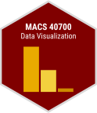

--- 
knit: bookdown::render_book
site: bookdown::bookdown_site
title: "Data Visualization"
description: "Contains notes for the spring 2022 course."
author: "Benjamin Soltoff"
date: "2022-04-01"
documentclass: book
bibliography: [book.bib, packages.bib]
biblio-style: apalike
link-citations: yes
github-repo: uc-dataviz/course-notes
---

# Data Visualization {-}

 This is the homepage for MACS 20700/40700 - Data Visualization. All course materials will be posted on this site.

Class meets on Tuesdays and Thursdays from 11-12:20pm in room 295 in [1155 E 60th St](https://goo.gl/maps/iAotTKUvpn27YJrP8).
